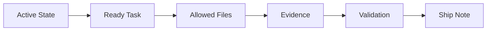

# Harness 360 Refactor - Ship Note

change: harness-360-refactor
status: shipped
date: 2026-06-28
owner: altitude-report

## Summary

The `harness-360-refactor` change is shipped as a documented harness governance and KB-quality foundation. It does not claim to complete the full Harness V3 runtime migration; it prepares the operating model, decomposition discipline, artifact density, MCP governance posture, and Fabric golden-domain governance needed before that migration.

## What Shipped

- Target operating model freeze.
- MCP governance matrix.
- Decomposition model and `SDD` vs `Task-Spec` selection rule.
- `.specs/memory` policy replacing `knowledge_context/` as the canonical live memory surface.
- Narrowed workflow route behavior.
- Dense Markdown authoring standard.
- Updated `.specs` templates, SDD templates, and Markdown-producing skills.
- KB governance standard.
- Microsoft Fabric critical-claim register and governance metadata.
- Fabric Copilot capacity contradiction repair.
- Fabric Eventhouse/Warehouse parity repair.

## Final Architecture Snapshot

### Final Topology

```text
.specs/changes/harness-360-refactor
  -> intent, structure, decomposition
  -> ready task contracts
  -> execution ledger
  -> evidence files
  -> validation ledger
  -> executive report
  -> ship note
```

### Final Diagram



## Validation Reference

- `.specs/changes/harness-360-refactor/04-validation.md`
- `V-001` through `V-013`
- `.specs/changes/harness-360-refactor/evidence/E-005-fabric-eventhouse-warehouse-parity-repair.md`

## Risks Accepted

- Some runtime enforcement remains advisory until the Harness V3 runtime-integration waves address RTK, Headroom, and hard state gates.
- Non-Fabric KB domains were not audited in this change.
- The V3 roadmap is not complete; it remains the next program of work.

## Rollback Note

Rollback is file-scoped. Revert the task-specific edits recorded in `03-execution-ledger.md` entries `E-001` through `E-015` if a shipped policy or KB claim proves incorrect.

For `T-009A`, rollback the Fabric Eventhouse/Warehouse concept edits and restore `FABRIC-CC-004` to follow-up-required if Microsoft Learn changes or invalidates the endpoint interpretation.

## Memory Impact

`.specs/memory/active-state.md` now points to report/ship completion instead of an execution-ready task. Future work should open a new change or resume from the Harness V3 roadmap safety-foundation pack.

## KT Notes

- `harness-360-refactor` is a foundation change, not the entire V3 migration.
- Fabric is the reference domain for the new KB governance model.
- `FABRIC-CC-004` should be interpreted as Eventhouse endpoint access over Warehouse data, not migration from Warehouse to standalone Eventhouse.
- Future durable work should keep PRD/ADR/TEST-SPEC and allocation concerns explicit when complexity justifies them.

## Follow-Up Watch Items

- Create golden behavior fixtures before mutating runtime behavior.
- Extract coordinator, state-resolution, phase-engine, and allocation contracts from the V3 roadmap.
- Decide whether RTK and Headroom are enforced runtime features or advisory/remove candidates.
- Audit additional KB domains after Fabric proves the governance model.

## Archive Status

Ready to archive after user review or commit.
