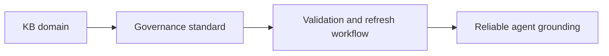

# Task

task_id: T-006A
title: Define KB governance standard
status: validated
change: harness-360-refactor
owner_agent: altitude-execution
slice_type: documentation-foundation
effort_class: S

## Objective

Define the reusable KB governance standard that future domain repairs, starting with Fabric, must follow.

## Context

The harness has already frozen the operating model, MCP matrix, and decomposition model. The next missing foundation is a KB standard that defines metadata, freshness, sources, contradiction handling, and validation expectations.

## Why This Slice Exists

Without a stable KB standard, every domain repair remains ad hoc and the Fabric golden-domain work has no shared target.

## Architecture Context

### Current State

```text
KB domains exist as useful documentation islands, but they do not yet share one explicit governance model for metadata, freshness, contradiction handling, or evidence posture.
```

### Target State

```text
The harness has one reusable KB governance standard that domain owners and future refresh workflows can apply consistently, starting with Microsoft Fabric.
```

### Impact Diagram



## Source References

- `docs/HARNESS_TARGET_OPERATING_MODEL.md`
- `docs/HARNESS_MCP_GOVERNANCE_MATRIX.md`
- `docs/HARNESS_REFACTOR_MASTER_PLAN.md`
- `kb/microsoft-fabric/index.md`
- `kb/microsoft-fabric/quick-reference.md`
- `agents/architect.kb-architect.agent.md`

## Allowed Files

- `docs/HARNESS_KB_GOVERNANCE_STANDARD.md`
- `docs/HARNESS_REFACTOR_MASTER_PLAN.md`
- `.specs/changes/harness-360-refactor/02-decomposition.md`
- `.specs/changes/harness-360-refactor/03-execution-ledger.md`
- `.specs/changes/harness-360-refactor/04-validation.md`
- `.specs/changes/harness-360-refactor/state.md`
- `.specs/changes/harness-360-refactor/tasks/T-006A-define-kb-governance-standard.md`
- `.specs/memory/active-state.md`

## Forbidden Scope

- `kb/microsoft-fabric/**`
- `config/routing.json`
- `opencode.json`
- `plugins/*.ts`

## Dependencies

- T-002
- T-003

## Implementation Steps

1. Define the required KB metadata surface.
2. Define freshness and source rules.
3. Define contradiction and validation rules.
4. Define how the standard applies to the Fabric golden domain.
5. Update the ledger and validation notes.

## Acceptance Criteria

| ID | Criterion | Verification Method | Evidence |
| --- | --- | --- | --- |
| AC-001 | A KB governance standard doc exists | Read doc | `docs/HARNESS_KB_GOVERNANCE_STANDARD.md` |
| AC-002 | The standard defines metadata, sources, freshness, contradiction handling, and validation expectations | Read doc | same artifact |
| AC-003 | The standard explicitly names Fabric as the first golden-domain consumer | Read doc | same artifact |

## Verification Commands

| Command | Purpose | Expected Signal |
| --- | --- | --- |
| manual consistency review | Check alignment with operating model, MCP matrix, and Fabric KB entry files | Standard is explicit, dense, and consistent |

## Evidence Required

| Evidence | Why It Is Needed |
| --- | --- |
| `docs/HARNESS_KB_GOVERNANCE_STANDARD.md` | Canonical output of the task |
| updated ledger and validation notes | Proves the task was completed and accepted |

## Rollback

Remove the KB governance standard doc and restore the ready-task state if the standard is found to be too weak or directionally wrong.

## Reviewer Notes

The standard must be practical enough to drive the Fabric repair wave immediately.

## Completion Checklist

- [x] Scope confirmed
- [x] Allowed files respected
- [x] Verification completed or justified
- [x] Evidence saved
- [x] Execution ledger updated
- [x] Ready for validation
