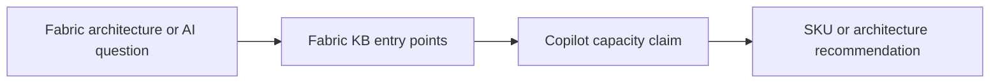

# Task

task_id: T-006B1
title: Repair Fabric Copilot capacity contradiction and align entry points
status: validated
change: harness-360-refactor
owner_agent: altitude-execution
slice_type: kb-contradiction-repair
effort_class: S

## Objective

Repair the known contradiction around Microsoft Fabric Copilot capacity requirements and align the affected Fabric KB entry points.

## Context

The current Fabric KB contains a known contradiction:

- `kb/microsoft-fabric/index.md` and `quick-reference.md` state Copilot is available on `F2+`
- `kb/microsoft-fabric/08-ai-capabilities/concepts/copilot-customization.md` still states `F64 or P1`

Because this is a critical domain claim that changes architecture decisions and SKU advice, the contradiction must be resolved with source-backed validation before any broader Fabric cleanup proceeds.

## Why This Slice Exists

This is the smallest high-value contradiction cluster in Fabric and is an ideal first golden-domain repair slice.

## Architecture Context

### Current State

```text
Fabric domain entry points disagree about the Copilot capacity threshold.
This means routing and architecture agents can make different recommendations depending on which KB file they happened to read first.
```

### Target State

```text
The three affected Fabric KB files agree on the validated Copilot capacity rule and explicitly reflect the same source-backed current-state claim.
```

### Impact Diagram



## Source References

- `docs/HARNESS_KB_GOVERNANCE_STANDARD.md`
- `docs/HARNESS_MCP_GOVERNANCE_MATRIX.md`
- `kb/microsoft-fabric/index.md`
- `kb/microsoft-fabric/quick-reference.md`
- `kb/microsoft-fabric/08-ai-capabilities/concepts/copilot-customization.md`
- `kb/microsoft-fabric/08-ai-capabilities/concepts/copilot-ml.md`

## Allowed Files

- `kb/microsoft-fabric/index.md`
- `kb/microsoft-fabric/quick-reference.md`
- `kb/microsoft-fabric/08-ai-capabilities/concepts/copilot-customization.md`
- `.specs/changes/harness-360-refactor/03-execution-ledger.md`
- `.specs/changes/harness-360-refactor/04-validation.md`
- `.specs/changes/harness-360-refactor/state.md`
- `.specs/changes/harness-360-refactor/tasks/T-006B1-repair-fabric-copilot-capacity-contradiction.md`
- `.specs/memory/active-state.md`

## Forbidden Scope

- other `kb/microsoft-fabric/**` files
- Fabric agent prompts
- `config/routing.json`
- `opencode.json`

## Dependencies

- T-006A

## Edge Cases and Failure Modes

| Case | Why It Matters | Expected Handling |
| --- | --- | --- |
| Official source is still ambiguous | The contradiction cannot be safely resolved | record uncertainty and block the task rather than guessing |
| Multiple official surfaces disagree | critical claim remains unstable | capture the conflict and stop broader rollout |

## Implementation Steps

1. Validate the current Copilot capacity claim against official-current sources.
2. Reconcile the conflicting local KB statements.
3. Update only the three allowed Fabric KB files.
4. Record the result in the ledger and validation notes.

## Acceptance Criteria

| ID | Criterion | Verification Method | Evidence |
| --- | --- | --- | --- |
| AC-001 | The contradiction is either resolved or explicitly blocked with source-backed reasoning | read updated files and validation notes | updated Fabric KB files + validation notes |
| AC-002 | The three allowed Fabric KB files no longer silently disagree on the Copilot capacity rule | grep/read review | updated Fabric KB files |

## Verification Commands

| Command | Purpose | Expected Signal |
| --- | --- | --- |
| source-backed manual review | confirm the current claim before editing | one source-backed rule or an explicit documented blocker |
| local file comparison | confirm the three files agree after edit | no silent contradiction remains |

## Evidence Required

| Evidence | Why It Is Needed |
| --- | --- |
| updated Fabric KB files | proves the contradiction cluster changed |
| updated ledger and validation notes | proves the claim was handled deliberately |

## Rollback

Revert the three Fabric KB files if the source-backed claim proves incorrect or still ambiguous.

## Reviewer Notes

Do not widen this task into general Fabric cleanup.

## Completion Checklist

- [x] Scope confirmed
- [x] Allowed files respected
- [x] Verification completed or justified
- [x] Evidence saved
- [x] Execution ledger updated
- [x] Ready for validation
