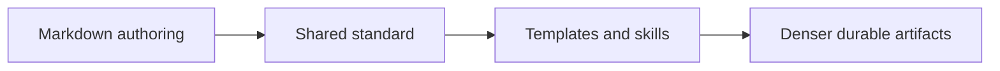

# Task

task_id: T-007A
title: Define Markdown authoring standard
status: validated
change: harness-360-refactor
owner_agent: altitude-execution
slice_type: documentation-foundation
effort_class: S

## Objective

Define the reusable standard that future durable Markdown artifacts must follow so they stop being structurally correct but operationally shallow.

## Context

The user explicitly asked for denser Markdown artifacts with architecture as text or Mermaid and stronger detail for KT and maintenance.

## Why This Slice Exists

Without a canonical standard, every future template or generated artifact can regress into shallowness.

## Architecture Context

### Current State

```text
Durable Markdown artifacts are created from templates and skills, but no shared quality contract explains the expected density, diagram posture, traceability, or anti-patterns.
```

### Target State

```text
The harness has a single reusable authoring standard that defines density, architecture views, traceability, evidence posture, and anti-patterns for all durable Markdown artifacts.
```

### Impact Diagram



## Source References

- user direction in this session
- `.specs/templates/*.md`
- `sdd/templates/*.md`

## Allowed Files

- `.specs/shared/markdown-authoring-standard.md`

## Forbidden Scope

- runtime config
- routing
- KB content

## Dependencies

- none

## Edge Cases and Failure Modes

| Case | Why It Matters | Expected Handling |
| --- | --- | --- |
| Standard is too vague | Templates remain shallow | Make rules explicit and artifact-specific |

## Implementation Steps

1. Define the purpose and posture.
2. Define density and diagram rules.
3. Define artifact minimums and anti-patterns.

## Acceptance Criteria

| ID | Criterion | Verification Method | Evidence |
| --- | --- | --- | --- |
| AC-001 | A shared standard exists | Read file | `.specs/shared/markdown-authoring-standard.md` |
| AC-002 | The standard covers density and diagrams | Read file | same artifact |

## Verification Commands

| Command | Purpose | Expected Signal |
| --- | --- | --- |
| manual review | Confirm the standard matches the requested quality bar | Explicit density, architecture, traceability, and anti-pattern rules present |

## Evidence Required

| Evidence | Why It Is Needed |
| --- | --- |
| `.specs/shared/markdown-authoring-standard.md` | It is the canonical output |

## Rollback

Remove the standard if it proves directionally wrong.

## Reviewer Notes

The standard should be strict enough to change future artifacts, not just describe good intentions.

## Completion Checklist

- [x] Scope confirmed
- [x] Allowed files respected
- [x] Verification completed or justified
- [x] Evidence saved
- [x] Execution ledger updated
- [x] Ready for validation
