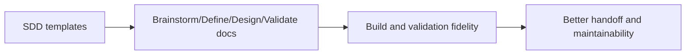

# Task

task_id: T-007C
title: Upgrade SDD templates for architecture depth
status: validated
change: harness-360-refactor
owner_agent: altitude-execution
slice_type: template-hardening
effort_class: M

## Objective

Upgrade the `sdd/templates` artifacts so brainstorm, define, design, build, validation, runbook, roadmap, and shipped documents are denser and more architectural.

## Context

The SDD templates were already richer than `.specs`, but still left too much room for shallow architecture output.

## Why This Slice Exists

These templates are the most visible artifact surfaces in the harness and strongly shape downstream quality.

## Architecture Context

### Current State

```text
SDD templates include many useful sections, but not enough mandatory architecture-as-text, Mermaid, interface, sequence, and failure-handling views.
```

### Target State

```text
SDD artifacts become strong architecture documents that support build, validation, KT, and operational handoff with less hidden context.
```

### Impact Diagram



## Source References

- `.specs/shared/markdown-authoring-standard.md`
- `sdd/templates/*.md`

## Allowed Files

- `sdd/templates/*.md`

## Forbidden Scope

- runtime config
- KB content

## Dependencies

- T-007A

## Edge Cases and Failure Modes

| Case | Why It Matters | Expected Handling |
| --- | --- | --- |
| More sections but no stronger semantics | Docs remain superficial | Add architecture views, interface contracts, and failure handling explicitly |

## Implementation Steps

1. Add architecture context and Mermaid to early-phase docs.
2. Add conformance and operational topology to later-phase docs.
3. Add KT-oriented sections where shipping and operations need them.

## Acceptance Criteria

| ID | Criterion | Verification Method | Evidence |
| --- | --- | --- | --- |
| AC-001 | Representative SDD templates now require architecture views | Read templates | `sdd/templates/*.md` |
| AC-002 | Validation and runbook templates are stronger for KT and operations | Read templates | same artifact set |

## Verification Commands

| Command | Purpose | Expected Signal |
| --- | --- | --- |
| manual review | Confirm representative templates are more architectural | Architecture views, failure modes, traceability, and operational notes present |

## Evidence Required

| Evidence | Why It Is Needed |
| --- | --- |
| updated `sdd/templates/*.md` | proves the SDD authoring surface changed |

## Rollback

Restore prior templates if the new structure becomes unusably noisy.

## Reviewer Notes

The extra density should help build and validation, not merely lengthen the documents.

## Completion Checklist

- [x] Scope confirmed
- [x] Allowed files respected
- [x] Verification completed or justified
- [x] Evidence saved
- [x] Execution ledger updated
- [x] Ready for validation
