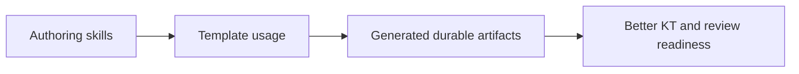

# Task

task_id: T-007D
title: Upgrade Markdown-producing skills
status: validated
change: harness-360-refactor
owner_agent: altitude-execution
slice_type: instruction-hardening
effort_class: S

## Objective

Upgrade the skill guidance that produces durable Markdown so the new density standard is enforced by process, not only by templates.

## Context

Templates help, but the producing skills also need to demand denser architecture-aware artifacts.

## Why This Slice Exists

Without skill-level reinforcement, future generated documents may still default to shallow output despite better templates.

## Architecture Context

### Current State

```text
Markdown-producing skills tell the harness how to generate artifacts, but they did not explicitly require a dense authoring standard or architecture views.
```

### Target State

```text
The workflow and scaffolding skills explicitly load the authoring standard and require dense architecture-aware output.
```

### Impact Diagram



## Source References

- `.specs/shared/markdown-authoring-standard.md`
- `skills/create-skills/SKILL.md`
- `skills/workflow-commands/SKILL.md`
- `skills/workflow-define/SKILL.md`
- `skills/workflow-design/SKILL.md`

## Allowed Files

- `skills/create-skills/SKILL.md`
- `skills/workflow-commands/SKILL.md`
- `skills/workflow-define/SKILL.md`
- `skills/workflow-design/SKILL.md`

## Forbidden Scope

- runtime config
- agent prompts outside these skill surfaces

## Dependencies

- T-007A

## Edge Cases and Failure Modes

| Case | Why It Matters | Expected Handling |
| --- | --- | --- |
| Skills mention density vaguely | Agents keep generating shallow docs | Reference the shared standard explicitly and add verification items |

## Implementation Steps

1. Reference the new standard.
2. Add density and architecture-view rules.
3. Add verification checklist items.

## Acceptance Criteria

| ID | Criterion | Verification Method | Evidence |
| --- | --- | --- | --- |
| AC-001 | Markdown-producing skills reference the shared standard | Read files | updated skill docs |
| AC-002 | Skills now explicitly require denser architecture-aware artifacts | Read files | updated skill docs |

## Verification Commands

| Command | Purpose | Expected Signal |
| --- | --- | --- |
| manual review | Confirm skills now enforce the standard | Explicit standard references and density rules present |

## Evidence Required

| Evidence | Why It Is Needed |
| --- | --- |
| updated skill docs | proves the authoring path changed |

## Rollback

Restore prior skill wording if the new density rules create unusable verbosity.

## Reviewer Notes

The skill layer should make the templates more likely to be used correctly, not merely restate them.

## Completion Checklist

- [x] Scope confirmed
- [x] Allowed files respected
- [x] Verification completed or justified
- [x] Evidence saved
- [x] Execution ledger updated
- [x] Ready for validation
