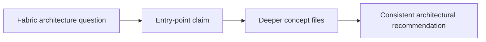

# Task

task_id: T-009A
title: Repair Fabric Eventhouse for Warehouse parity gap
status: validated
change: harness-360-refactor
owner_agent: altitude-execution
slice_type: kb-contradiction-repair
effort_class: S

## Objective

Repair the remaining parity gap around the `Eventhouse for Warehouse` claim by aligning deeper Fabric concept surfaces with the domain entry points.

## Context

The Fabric domain entry files now explicitly register `FABRIC-CC-004` as a remaining gap. Entry points mention `Eventhouse for Warehouse`, but the deeper supporting concept surfaces do not yet clearly reflect that claim.

## Why This Slice Exists

This is now the highest-priority remaining entry-point parity gap in the Fabric golden-domain rollout.

## Architecture Context

### Current State

```text
Fabric entry points mention the Eventhouse-on-Warehouse posture, but the deeper Eventhouse and Warehouse concept surfaces do not yet provide a clear supporting explanation.
```

### Target State

```text
The Eventhouse and Warehouse concept surfaces provide enough supporting detail that the entry-point claim no longer stands alone.
```

### Impact Diagram



## Source References

- `docs/HARNESS_KB_GOVERNANCE_STANDARD.md`
- `kb/microsoft-fabric/index.md`
- `kb/microsoft-fabric/quick-reference.md`
- `kb/microsoft-fabric/01-logging-monitoring/concepts/eventhouse-basics.md`
- `kb/microsoft-fabric/04-data-warehouse/concepts/warehouse-basics.md`

## Allowed Files

- `kb/microsoft-fabric/01-logging-monitoring/concepts/eventhouse-basics.md`
- `kb/microsoft-fabric/04-data-warehouse/concepts/warehouse-basics.md`
- `kb/microsoft-fabric/index.md`
- `kb/microsoft-fabric/quick-reference.md`
- `kb/microsoft-fabric/specs/fabric-config.yaml`
- `.specs/changes/harness-360-refactor/03-execution-ledger.md`
- `.specs/changes/harness-360-refactor/04-validation.md`
- `.specs/changes/harness-360-refactor/state.md`
- `.specs/changes/harness-360-refactor/tasks/T-009A-repair-fabric-eventhouse-warehouse-parity.md`
- `.specs/memory/active-state.md`

## Forbidden Scope

- other Fabric domains
- Fabric agent prompts
- routing/config changes

## Dependencies

- T-006B3

## Edge Cases and Failure Modes

| Case | Why It Matters | Expected Handling |
| --- | --- | --- |
| Official sources are ambiguous | parity cannot be safely repaired | block and record uncertainty |
| Deeper docs imply a different architectural boundary | entry-point claim may need narrowing | update supporting docs and, if necessary, adjust entry wording inside scope |

## Implementation Steps

1. Validate the Eventhouse for Warehouse claim against official-current sources.
2. Align the deeper Eventhouse and Warehouse concept surfaces.
3. Update entry-point wording only if needed for consistency.
4. Record evidence and validation.

## Acceptance Criteria

| ID | Criterion | Verification Method | Evidence |
| --- | --- | --- | --- |
| AC-001 | The deeper concept files support the entry-point claim or narrow it explicitly | read updated files | updated concept files |
| AC-002 | The entry-point claim no longer stands alone as an unsupported high-impact statement | parity review | updated entry and concept files |

## Verification Commands

| Command | Purpose | Expected Signal |
| --- | --- | --- |
| source-backed manual review | confirm the current claim before editing | one source-backed interpretation |
| local parity review | confirm entry and concept files now align | no unsupported parity gap remains |

## Evidence Required

| Evidence | Why It Is Needed |
| --- | --- |
| updated Fabric concept and entry files | proves the parity gap was repaired |
| updated ledger and validation notes | proves the change was deliberate and checked |

## Rollback

Revert the affected Fabric files if the claim proves wrong or still ambiguous.

## Reviewer Notes

Keep this slice narrowly focused on the Eventhouse/Warehouse parity gap.

## Completion Checklist

- [x] Scope confirmed
- [x] Allowed files respected
- [x] Verification completed or justified
- [x] Evidence saved
- [x] Execution ledger updated
- [x] Ready for validation
