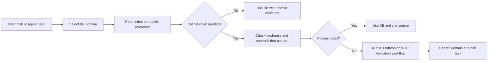
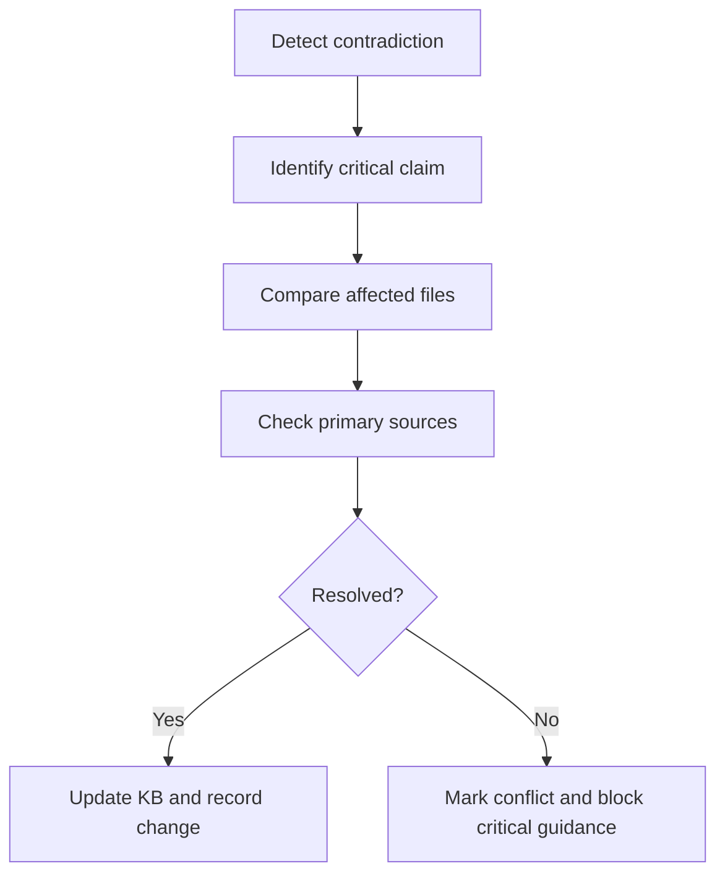

# Harness KB Governance Standard

## Purpose

Define the canonical governance standard for knowledge-base domains used by this harness.

This standard exists to make KBs:

- current enough for production guidance
- dense enough for smaller models and human KT
- explicit enough to detect contradictions
- structured enough to support validation, refresh, and domain ownership

## Grounding

This standard is grounded in:

- `docs/HARNESS_TARGET_OPERATING_MODEL.md`
- `docs/HARNESS_MCP_GOVERNANCE_MATRIX.md`
- `.specs/shared/markdown-authoring-standard.md`
- `agents/architect.kb-architect.agent.md`
- `kb/microsoft-fabric/index.md`
- `kb/microsoft-fabric/quick-reference.md`

## Design Goals

- make KB quality auditable
- make critical claims traceable to sources
- make refresh work repeatable instead of ad hoc guesswork
- make contradictions visible early
- create a strong golden-domain model starting with Microsoft Fabric

## KB Operating Topology

### Architecture As Text

```text
[User request or agent task]
  -> [Routing and domain selection]
  -> [KB domain entry points: index + quick-reference]
  -> [Detailed concept/pattern/reference files]
  -> [Source and freshness validation]
  -> [Contradiction gate]
  -> [Agent response or KB refresh workflow]
```

### Governance Flow



## Domain Anatomy

Every KB domain should converge toward this structure:

```text
kb/{domain}/
├── index.md
├── quick-reference.md
├── concepts/
├── patterns/
├── reference/
├── specs/
└── governance.md or specs/{domain}-governance.yaml
```

### File Roles

| File class | Primary purpose | Expected use |
| --- | --- | --- |
| `index.md` | domain map and navigation | first read for broad orientation |
| `quick-reference.md` | high-signal lookup table | first read for implementation and fast decisions |
| `concepts/*.md` | explain one idea precisely | grounding and terminology |
| `patterns/*.md` | explain repeatable implementation path | direct implementation guidance |
| `reference/*.md` | APIs, commands, field maps, limits | exact lookup and verification |
| `specs/*.yaml` | machine-readable schema, settings, matrices | validation and structured consumption |

## Required Metadata Surface

Every domain must expose the following governance fields, either directly in the file header, a domain governance file, or both.

| Field | Scope | Purpose |
| --- | --- | --- |
| `domain_owner` | domain | accountable maintainer |
| `review_tier` | domain | risk class: critical, important, advisory |
| `freshness_window_days` | domain | expected review cadence |
| `primary_sources` | domain or file | official sources of truth |
| `validated_at` | file or domain | most recent validation timestamp |
| `confidence` | file or critical section | known confidence level |
| `critical_claims` | file or domain | claims that can block execution if stale or conflicting |
| `last_change_summary` | domain | what materially changed in the last refresh |

### Minimum Header Example

```markdown
> **Validated At:** 2026-06-25
> **Domain Owner:** platform-team
> **Review Tier:** critical
> **Freshness Window:** 30 days
> **Primary Sources:** official docs, vendor release notes
> **Confidence:** 0.95
```

### Machine-Readable Governance Example

```yaml
domain: microsoft-fabric
domain_owner: platform-team
review_tier: critical
freshness_window_days: 30
primary_sources:
  - microsoftdocs/fabric-docs
  - release-notes
critical_claims:
  - copilot-capacity-requirements
  - warehouse-security-capabilities
  - deployment-automation-surface
```

## Density Standard for KB Content

KB files must follow the general Markdown density standard and add KB-specific expectations:

- quick-reference files should optimize for speed, not shallowness
- concept files should explain boundaries, not just definitions
- pattern files should include preconditions, failure modes, and when not to use the pattern
- critical domains should prefer architecture-as-text and tables over vague summaries

## Source Rules

### Source Hierarchy

1. official vendor or framework docs
2. official release notes or changelogs
3. canonical API or product references
4. high-confidence production examples

### Source Discipline

- Every critical claim must be tied to at least one primary source.
- When a claim is recency-sensitive, prefer an official source plus a release note or equivalent change record.
- If only secondary sources exist for a critical claim, treat the file as lower confidence and do not present the claim as settled fact.

## Freshness Policy

Freshness windows depend on risk and volatility.

| Domain type | Examples | Default freshness window |
| --- | --- | --- |
| fast-moving critical | Fabric AI, security, cloud platform features, auth/RLS | 30 days |
| important vendor surface | orchestration tools, CI/CD, APIs, data platforms | 60 days |
| slower-moving core concepts | modeling basics, testing principles, dimensional design | 180 days |

### Refresh Triggers

Run refresh when any of the following is true:

- `validated_at` exceeds the freshness window
- a critical claim conflicts with another local KB file
- a task fails because the KB was wrong, stale, or ambiguous
- a vendor release changes behavior in the domain
- unresolved placeholders or broken links remain in the domain

## Contradiction Policy

### Critical Contradiction

A contradiction is critical when two or more KB surfaces disagree on a claim that could change:

- architecture choice
- security posture
- capacity or SKU requirement
- data model or contract behavior
- deployment path

### Contradiction Workflow



### Hard-Stop Rule

If a critical domain contains an unresolved contradiction on a critical claim, the harness must not present the claim as reliable implementation guidance.

## Validation Workflow

### Validation Layers

| Layer | Question |
| --- | --- |
| Structure | Does the domain have the expected files and navigation? |
| Freshness | Is the content still inside the domain freshness window? |
| Source trace | Are critical claims tied to real primary sources? |
| Contradiction | Do local files disagree on critical claims? |
| Operational value | Would a smaller model or new engineer actually be able to use this file? |

### Validation Checklist

- [ ] domain owner is named
- [ ] review tier is named
- [ ] freshness window is defined
- [ ] validated date is present
- [ ] critical claims are identifiable
- [ ] critical claims have primary sources
- [ ] local contradictions are checked
- [ ] quick-reference and index are aligned with detailed files
- [ ] the file is dense enough to be operationally useful

## Evidence Contract For KB Updates

Every KB refresh or repair should capture:

- files changed
- claims updated
- source set used
- contradiction resolved or still open
- residual uncertainty
- resulting freshness date and confidence

Acceptable evidence surfaces:

- change evidence under `.specs/changes/.../evidence/`
- validation notes
- domain governance notes

## Golden Domain Rollout

Microsoft Fabric is the first golden domain.

### Why Fabric Goes First

- it is already known to contain contradictions
- it is high-volatility and high-impact
- it exercises architecture, pipeline, security, CI/CD, and AI surfaces at once

### Golden-Domain Requirements

Fabric should become the first domain that has:

- explicit owner and review tier
- contradiction register for critical claims
- aligned `index.md` and `quick-reference.md`
- validated examples for critical workflows
- clear separation between stable concepts and volatile features
- refresh evidence when claims change

### Fabric Priority Claims

The first Fabric repair wave should prioritize claims that affect build decisions directly, such as:

- Copilot capacity requirements
- workload selection rules
- warehouse security capabilities
- CI/CD and deployment automation posture
- preview versus GA feature boundaries

## Operational Anti-Patterns

Do not allow these KB behaviors to continue:

- dense-looking but source-free docs
- quick-reference files that disagree with deeper files
- stale `validated_at` dates with no review note
- vendor marketing language presented as settled implementation fact
- splitting files so aggressively that reasoning disappears
- refusing to mark uncertainty when facts are incomplete

## Success Criteria

This standard is adopted when:

- future KB work uses the required metadata surface
- critical claims become source-traceable
- contradictions can be detected and escalated cleanly
- Fabric can be upgraded into a reliable golden domain using this standard
