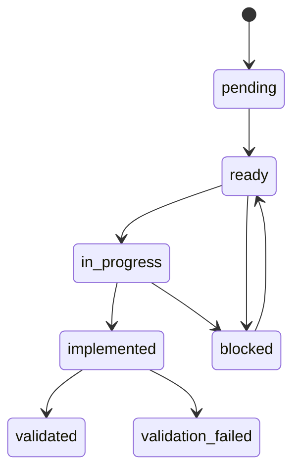
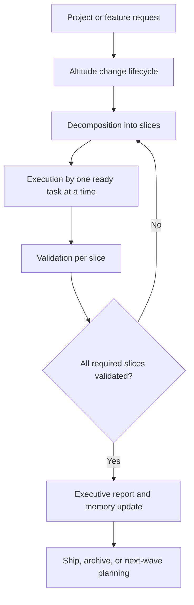

# Harness Evolution Tree

## Purpose

Show the harness as a text architecture tree from intake to the point where it can deliver:

- one ready task
- one implemented and validated task
- one delivered project or feature wave

This document is intentionally dense and operational. It is meant to help humans and smaller models understand where the harness currently stands and how work should flow through it.

## Reading Guide

- `current tree` = where the harness is now
- `target tree` = the intended end-state after the refactor
- `task branch` = how one leaf task moves through the system
- `project branch` = how a larger project or feature wave moves through the system

## Current Evolution Tree

```text
HARNESS
└── OpenCode runtime
    ├── Global policy
    │   ├── AGENTS.md
    │   ├── config/grounding.md
    │   ├── config/security-settings.json
    │   └── plugins/*.ts
    ├── Orchestration surfaces
    │   ├── Altitude primary agents
    │   │   ├── altitude-intent
    │   │   ├── altitude-structure
    │   │   ├── altitude-plan
    │   │   ├── altitude-execution
    │   │   ├── altitude-validation
    │   │   ├── altitude-report
    │   │   └── altitude-memory
    │   ├── Compatibility command layer
    │   │   └── /workflow:*
    │   └── Specialist and utility surfaces
    │       ├── dev.codebase-explorer
    │       ├── graph-router
    │       ├── architect.*
    │       ├── product.*
    │       ├── platform.*
    │       └── data-engineering.*
    ├── Durable state surfaces
    │   ├── .specs/changes/
    │   ├── .specs/memory/
    │   └── docs/
    ├── Reusable method surfaces
    │   ├── sdd/architecture/
    │   ├── sdd/templates/
    │   └── .specs/templates/
    ├── Grounding surfaces
    │   ├── kb/
    │   ├── .specs/shared/mcp-governance.md
    │   └── .specs/shared/markdown-authoring-standard.md
    └── Active refactor state
        ├── Control plane frozen
        ├── MCP matrix frozen
        ├── Decomposition model frozen
        ├── Markdown density standard frozen
        ├── KB governance standard frozen
        └── Next repair wave: Fabric contradiction clusters
```

## Target Evolution Tree

```text
HARNESS
└── Intake
    ├── Explicit native command
    │   └── command-first execution path
    └── Ambiguous natural language
        ├── explore
        ├── interview / grill
        └── altitude-intent
            └── clarified durable change

HARNESS
└── Durable coordination
    └── Altitude coordinator
        ├── Intent
        │   └── 00-intent.md
        ├── Structure
        │   └── 01-structure.md
        ├── Decomposition
        │   ├── 02-decomposition.md
        │   ├── tasks/*.md
        │   └── Task-Spec leaf tasks when appropriate
        ├── Execution
        │   └── exactly one ready task
        ├── Validation
        │   └── evidence-backed verdict
        ├── Report
        │   └── executive and technical reporting
        └── Memory
            └── durable lessons and project context

HARNESS
└── Delivery
    ├── Task delivery
    │   ├── one slice
    │   ├── one contract
    │   ├── one verification path
    │   └── one validation verdict
    └── Project or feature delivery
        ├── multiple validated slices
        ├── consolidated report
        ├── runbook or roadmap as needed
        └── ship or archive decision
```

## Task Delivery Branch

### Architecture As Text

```text
[User request or planned wave]
  -> [Altitude intent clarifies the change]
  -> [Altitude structure maps the repo and risks]
  -> [Altitude plan creates one small ready task]
  -> [Altitude execution edits only the allowed files]
  -> [Altitude validation checks scope, evidence, and acceptance]
  -> [Task becomes validated or returns to planning/execution]
```

### Task Tree

```text
TASK
└── Request enters harness
    ├── If ambiguous
    │   ├── explore
    │   ├── interview / grill
    │   └── clarified objective
    └── If explicit
        └── route directly to the relevant path

TASK
└── Durable change exists
    ├── intent artifact exists
    ├── structure artifact exists
    └── decomposition artifact exists

TASK
└── Ready leaf task exists
    ├── objective
    ├── architecture boundary
    ├── allowed files
    ├── forbidden scope
    ├── acceptance criteria
    ├── verification commands
    ├── evidence required
    └── rollback

TASK
└── Execution
    ├── source-backed grounding when needed
    ├── one slice implemented
    ├── evidence written
    └── execution ledger updated

TASK
└── Validation
    ├── scope check
    ├── traceability check
    ├── verification review
    └── verdict
        ├── validated
        ├── validation_failed
        └── blocked
```

### Task State Diagram



## Project Delivery Branch

### Architecture As Text

```text
[Project or feature intent]
  -> [Altitude change lifecycle]
  -> [multiple bounded leaf tasks]
  -> [validated slices accumulate]
  -> [report and memory layers summarize the change]
  -> [project becomes ready for ship, archive, or next wave]
```

### Project Tree

```text
PROJECT OR FEATURE WAVE
└── Intake
    ├── problem statement
    ├── target users or stakeholders
    ├── constraints
    └── success conditions

PROJECT OR FEATURE WAVE
└── Change lifecycle
    ├── 00-intent.md
    ├── 01-structure.md
    ├── 02-decomposition.md
    ├── tasks/
    ├── decisions/
    ├── evidence/
    ├── 03-execution-ledger.md
    ├── 04-validation.md
    ├── 05-executive-report.md
    └── 06-ship-note.md

PROJECT OR FEATURE WAVE
└── Build-out by slices
    ├── Slice A validated
    ├── Slice B validated
    ├── Slice C validated
    └── unresolved work either deferred or re-planned

PROJECT OR FEATURE WAVE
└── Delivery outputs
    ├── technical artifacts complete
    ├── validation evidence complete
    ├── runbook or roadmap prepared
    ├── memory updated
    └── ship / archive / next-wave decision
```

### Project Flow Diagram



## Current Refactor Position In The Tree

```text
REFRACTOR POSITION
└── Durable foundations complete
    ├── control plane defined
    ├── MCP governance defined
    ├── decomposition model defined
    ├── Markdown density standard defined
    └── KB governance standard defined

REFRACTOR POSITION
└── Next execution branch
    └── Fabric golden-domain repair
        ├── T-006B1 ready
        │   └── repair Copilot capacity contradiction
        ├── T-006B2 pending
        │   └── add governance metadata and critical-claim register
        └── T-006B3 pending
            └── audit remaining high-impact claim parity
```

## What “Delivered” Means Now

### Delivered Task

A task is delivered when it is:

- implemented inside allowed scope
- backed by evidence
- validated against acceptance criteria
- traceable in the ledger

### Delivered Project or Feature Wave

A project or feature wave is delivered when:

- its required tasks are validated
- its report layer explains the result
- its operational consequences are known
- its memory surface is updated
- the next lifecycle decision is explicit: ship, archive, or next wave
