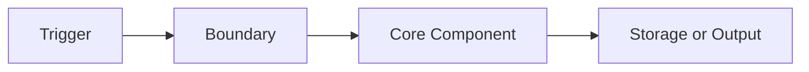

# Markdown Authoring Standard

## Purpose

Define the minimum quality bar for durable Markdown artifacts produced by this harness.

This standard exists because structurally correct artifacts can still be too shallow to support architecture work, knowledge transfer, maintenance, or validation.

## Default Writing Posture

Write durable artifacts as if they will be used by:

- a new engineer joining the project
- a reviewer validating architectural intent
- a smaller model with weak hidden context
- an operator debugging the system after the original author is gone

Durable artifacts must therefore be explicit, dense, and evidence-friendly.

## Core Rules

### 1. Explain the system, not only the task

Every non-trivial artifact should describe:

- current state
- target state
- boundary of change
- affected components
- expected behavior after the change

### 2. Prefer structure over prose blobs

Good durable documents mix:

- short explanatory paragraphs
- decision tables
- traceability tables
- step-by-step flows
- architecture views

### 3. Use architecture views when the artifact describes behavior or structure

If an artifact describes system shape, data flow, orchestration, state changes, or operational behavior, it should include one or both of:

- architecture as text
- Mermaid diagram

Preferred Mermaid views:

- `flowchart`
- `sequenceDiagram`
- `stateDiagram-v2`
- `classDiagram`
- `erDiagram`

### 4. Name why, not only what

A durable artifact must explain:

- why the choice exists
- why the boundary is correct
- why alternatives were rejected
- why the verification path proves the claim

### 5. Make validation possible

Wherever the artifact asserts a behavior, it should make the validation path visible through:

- source references
- acceptance criteria
- evidence pointers
- commands
- expected signals

## Density Rules

- Avoid placeholder sections that contain only one vague sentence.
- Avoid empty headings with no implied content structure.
- Avoid generic text such as `improved`, `optimized`, or `works better` without a concrete observable consequence.
- Avoid architecture diagrams that are visually neat but semantically empty.
- Prefer a denser document with fewer headings over a long sparse document with repetitive headings.

## Artifact Minimums

| Artifact type | Minimum density expectation |
| --- | --- |
| Change / intent / plan | problem topology, target state, workstreams, risks, success conditions |
| Design / architecture | architecture as text, Mermaid, decisions, interface contracts, failure handling |
| Task | slice boundary, impact topology, acceptance-to-evidence trace, rollback |
| Validation | scope proof, traceability, findings severity, decision rationale |
| Runbook / roadmap / ship note | operational topology, release flow, ownership, rollback, residual risk |
| Evidence | context, captured output, interpretation, why the evidence matters |
| Skill / command docs | when to use, when not to use, process, rationalizations, red flags, verification |

## Recommended Section Types

Use these section types when relevant.

### Architecture As Text

```text
[User / Trigger]
  -> [Entry Point]
  -> [Decision / Validation Boundary]
  -> [Core Component]
  -> [Storage / Output / Side Effect]
```

### Mermaid System View



### Decision Table

| Decision | Chosen option | Why | Rejected alternative |
| --- | --- | --- | --- |

### Traceability Table

| Requirement or claim | Implemented by | Verified by | Evidence |
| --- | --- | --- | --- |

### Failure Mode Table

| Failure mode | Signal | Mitigation | Rollback or follow-up |
| --- | --- | --- | --- |

## Anti-Patterns

Do not produce:

- pretty but content-light diagrams
- one-line sections that restate the heading
- vague acceptance criteria without verification method
- decisions without alternatives
- architecture docs without interfaces, dependencies, or failure paths
- status docs that omit next action and blocker posture

## Operational Rule

When a template is too shallow to support this standard, upgrade the template instead of asking future documents to compensate informally.
