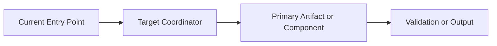

# Change Request

change_id:
title:
status: draft
created:
owner:

## Executive Intent

### Problem

### Objective

### Why Now

### Non-Goals

## Purpose

## Current State

### Current Topology

```text
{Describe the current control flow, system boundary, or operating model before the change.}
```

## Target State

### Target Topology

```text
{Describe the intended future control flow, system boundary, or operating model after the change.}
```

### Target Diagram



## Scope Boundaries

| Area | In Scope | Out of Scope | Notes |
| --- | --- | --- | --- |
| {Area 1} | {Yes/No} | {Yes/No} | {Why} |

## Success Conditions

| Condition | How It Will Be Verified | Evidence |
| --- | --- | --- |
| {Condition 1} | {Method} | {Path or artifact} |

## Workstreams

| Workstream | Objective | Likely Files | Risk |
| --- | --- | --- | --- |
| {Workstream 1} | {Goal} | {Files} | {Low/Medium/High} |

## Risk Register

| Risk | Impact | Likelihood | Mitigation |
| --- | --- | --- | --- |
| {Risk 1} | {High/Medium/Low} | {High/Medium/Low} | {Mitigation} |

## Altitude Artifacts

- [ ] `00-intent.md`
- [ ] `01-structure.md`
- [ ] `02-decomposition.md`
- [ ] `03-execution-ledger.md`
- [ ] `04-validation.md`
- [ ] `05-executive-report.md`
- [ ] `06-ship-note.md`

## Directories

- `tasks/`
- `decisions/`
- `evidence/`
- `reviews/`

## Notes For Authors

- This document should be dense enough for a new engineer to understand the change boundary without reading chat history.
- Use architecture as text and Mermaid whenever the change alters system flow, orchestration, or ownership.
