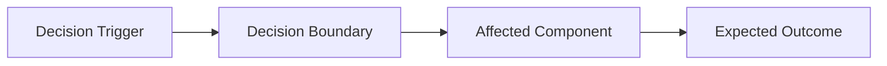

# ADR-000 Decision Title

status:
date:
change:
owner:

## Context

## Decision Drivers

| Driver | Description | Weight |
| --- | --- | --- |
| {Driver 1} | {Why this matters} | {High/Medium/Low} |

## Decision

## Architecture Impact

### Impact As Text

```text
{Describe which boundary, component, or workflow changes because of this decision.}
```

### Impact Diagram



## Alternatives Considered

| Option | Pros | Cons | Why Rejected or Chosen |
| --- | --- | --- | --- |
| {Option A} | {Pros} | {Cons} | {Reason} |

## Consequences

### Positive Consequences

### Negative Consequences

### Deferred Consequences

## Evidence

## Follow-Up Actions
