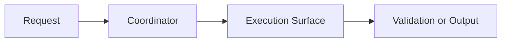

# Executive Report

change:
status:
date:
owner:

## Executive Summary

## Current Status

## Architecture Status

### Current Operating Topology

```text
{Describe the current operating model, ownership flow, and artifact flow.}
```

### Current Diagram



## Completed Work

## Pending Work

## Traceability Snapshot

| Workstream | Status | Evidence | Risk |
| --- | --- | --- | --- |
| {Workstream 1} | {Status} | {Evidence} | {Risk} |

## Risks

## Blockers

## Decisions

## Validation Evidence

## Business Impact

## Technical Impact

## Operational Impact

## Next Recommended Action
