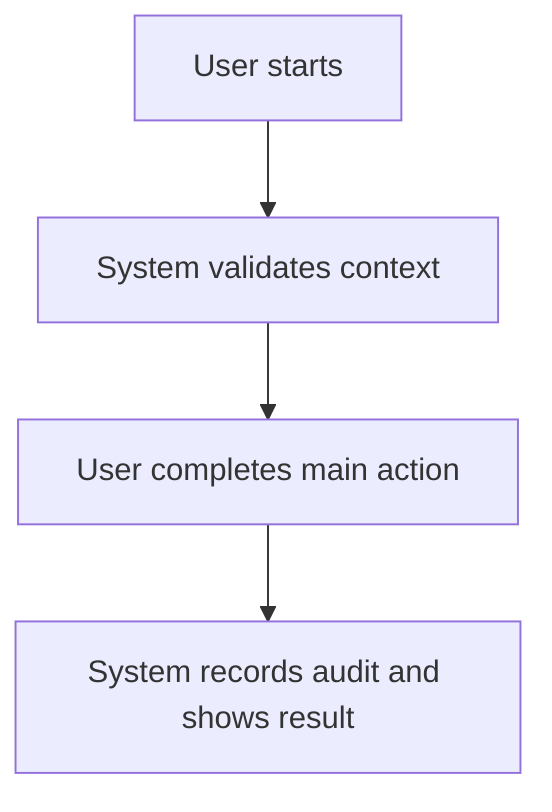

# PRD: <product or capability name>

## How to use this template

Use this document to define what should be built, why it matters, who it serves, how success will be measured, and what constraints shape the solution. A PRD is not a full technical design, backlog, ADR, or test plan. It should create enough clarity for design, engineering, data, AI, QA, security, and operations to plan work.

## PRD metadata

| Field | Value |
|---|---|
| PRD ID | `PRD-0000` |
| Product area | `<area>` |
| Target release | `<release/date>` |
| Product owner | `<name>` |
| Tech lead | `<name>` |
| Design owner | `<name>` |
| Data/AI owner | `<name>` |
| Status | `draft` / `in_review` / `approved` / `shipped` / `deprecated` |

## 1. Summary

Write the PRD in one paragraph.

> We will build `<capability>` for `<user/persona>` so that `<user/business outcome>`. Success means `<measurable outcome>`. This release intentionally excludes `<major non-goal>`.

## 2. Problem statement

Describe the current problem. Include evidence where possible.

| Problem signal | Evidence | Impact |
|---|---|---|
| `<pain or gap>` | `<metric/ticket/interview/log/business input>` | `<impact>` |

## 3. Users and stakeholders

| Persona/stakeholder | Need | Current workaround | Decision power |
|---|---|---|---|
| `<persona>` | `<need>` | `<workaround>` | high/medium/low |

## 4. Goals

| Goal | Metric | Target | Deadline |
|---|---|---:|---|
| `<goal>` | `<metric>` | `<target>` | `YYYY-MM-DD` |

## 5. Non-goals

List what the product will not solve in this version.

- `<non-goal>`
- `<non-goal>`

## 6. Use cases

### Use case 1: <name>

| Field | Description |
|---|---|
| Actor | `<user/system>` |
| Trigger | `<event>` |
| Preconditions | `<what must be true>` |
| Main flow | `<numbered steps>` |
| Alternative flow | `<branch>` |
| Failure flow | `<failure and expected behavior>` |
| Expected outcome | `<result>` |
| Priority | Must/Should/Could |

## 7. Functional requirements

Use `FR-###` IDs for traceability.

| ID | Requirement | Priority | Acceptance criteria | Notes |
|---|---|---|---|---|
| FR-001 | The system shall `<behavior>` | Must | Given `<context>`, when `<action>`, then `<result>` | `<notes>` |

## 8. Non-functional requirements

Use `NFR-###` IDs.

| ID | Category | Requirement | Target | Validation method |
|---|---|---|---|---|
| NFR-001 | Performance | `<requirement>` | `<threshold>` | `<test/evidence>` |
| NFR-002 | Reliability | `<requirement>` | `<threshold>` | `<test/evidence>` |
| NFR-003 | Security | `<requirement>` | `<control>` | `<review/test>` |
| NFR-004 | Observability | `<requirement>` | `<logs/metrics/traces>` | `<dashboard/evidence>` |
| NFR-005 | Data quality | `<requirement>` | `<rule/threshold>` | `<DQ evidence>` |
| NFR-006 | AI/model quality | `<requirement>` | `<metric/threshold>` | `<evaluation evidence>` |

## 9. Data, AI, and analytics requirements

Use this section when the product depends on data pipelines, models, retrieval, evaluation, dashboards, or AI agents.

| Area | Requirement | Owner | Validation |
|---|---|---|---|
| Data source | `<source/system/table/API>` | `<owner>` | `<validation>` |
| Data contract | `<schema, SLA, freshness, lineage>` | `<owner>` | `<validation>` |
| Retrieval/RAG | `<index, chunking, metadata, ranking>` | `<owner>` | `<evaluation>` |
| Model behavior | `<model, prompt, tool, guardrail>` | `<owner>` | `<evaluation>` |
| Drift monitoring | `<feature/model/data drift>` | `<owner>` | `<monitoring>` |
| Dashboard/reporting | `<Power BI/BI/API needs>` | `<owner>` | `<validation>` |

## 10. UX and workflow requirements

Describe the intended user flow. Link to mockups when available.

| Screen/step | User action | System response | Error/empty/loading behavior |
|---|---|---|---|
| `<step>` | `<action>` | `<response>` | `<state>` |

## 11. Dependencies

| Dependency | Type | Owner | Required by | Risk |
|---|---|---|---|---|
| `<dependency>` | system/team/vendor/data/security | `<owner>` | `YYYY-MM-DD` | `<risk>` |

## 12. Rollout and migration

| Phase | Audience/scope | Entry criteria | Exit criteria | Rollback/degrade path |
|---|---|---|---|---|
| Alpha | `<scope>` | `<criteria>` | `<criteria>` | `<path>` |
| Beta | `<scope>` | `<criteria>` | `<criteria>` | `<path>` |
| GA | `<scope>` | `<criteria>` | `<criteria>` | `<path>` |

## 13. Risks and assumptions

| Type | Statement | Impact | Mitigation/validation |
|---|---|---|---|
| Risk | `<risk>` | `<impact>` | `<mitigation>` |
| Assumption | `<assumption>` | `<impact if false>` | `<how to validate>` |

## 14. Metrics and success criteria

| Metric | Definition | Baseline | Target | Owner | Instrumentation |
|---|---|---:|---:|---|---|
| `<metric>` | `<definition>` | `<value>` | `<value>` | `<owner>` | `<event/log/dashboard>` |

## 15. Open questions

| Question | Owner | Decision needed by | Status |
|---|---|---|---|
| `<question>` | `<owner>` | `YYYY-MM-DD` | open/answered/deferred |

## 16. Handoff to engineering and QA

- Required ADRs: `<links or TBD>`
- Required test specs: `<links or TBD>`
- Required tasks/epics: `<links or TBD>`
- Required security/privacy review: `<yes/no/link>`
- Required data governance review: `<yes/no/link>`
- Required runbook/update: `<yes/no/link>`

---

## Review checklist

Use this checklist before marking the document as `in_review` or `approved`.

- [ ] The objective is explicit and does not depend on hidden context.
- [ ] Scope and non-scope are both defined.
- [ ] The owner, reviewers, approvers, dates, status, and related work items are filled.
- [ ] Assumptions, risks, dependencies, and open questions are visible.
- [ ] Acceptance criteria or validation criteria are testable.
- [ ] Evidence links are concrete, not generic statements.
- [ ] Rollback, mitigation, or contingency is defined where risk exists.
- [ ] Terms, IDs, tables, environments, and systems use canonical names.
- [ ] The document can be understood by a new reviewer without the original meeting context.

## Change log

| Date | Author | Change | Reason |
|---|---|---|---|
| YYYY-MM-DD | <name> | Initial draft | Created from template |
