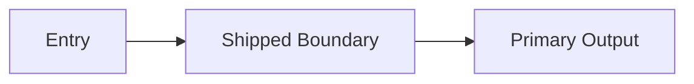

# Ship Note

change:
status:
date:
owner:

## Summary

## What Shipped

## Final Architecture Snapshot

### Final Topology

```text
{Describe the final operating or system flow that was shipped.}
```

### Final Diagram



## Validation Reference

## Risks Accepted

## Rollback Note

## Memory Impact

## KT Notes

## Follow-Up Watch Items

## Archive Status
