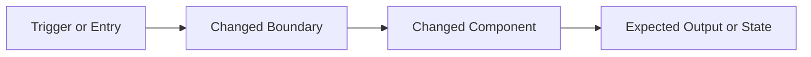

# Task

task_id:
title:
status: pending
change:
owner_agent: altitude-execution
slice_type:
effort_class:

## Objective

## Context

## Why This Slice Exists

## Architecture Context

### Current State

```text
{Describe the current flow or boundary that this task is changing.}
```

### Target State

```text
{Describe the desired flow or boundary after this task completes.}
```

### Impact Diagram



## Source References

## Allowed Files

## Forbidden Scope

## Dependencies

## Edge Cases and Failure Modes

| Case | Why It Matters | Expected Handling |
| --- | --- | --- |
| {Case 1} | {Reason} | {Handling} |

## Implementation Steps

## Acceptance Criteria

| ID | Criterion | Verification Method | Evidence |
| --- | --- | --- | --- |
| AC-001 | {Observable outcome} | {Command, review, or test} | {Artifact or path} |

## Verification Commands

| Command | Purpose | Expected Signal |
| --- | --- | --- |
| `{command}` | {Why run it} | {What success looks like} |

## Evidence Required

| Evidence | Why It Is Needed |
| --- | --- |
| {Artifact or output} | {Reason} |

## Rollback

## Reviewer Notes

## Completion Checklist

- [ ] Scope confirmed
- [ ] Allowed files respected
- [ ] Verification completed or justified
- [ ] Evidence saved
- [ ] Execution ledger updated
- [ ] Ready for validation

## Notes For Authors

- A ready task must be understandable without opening the full design document.
- Use the architecture sections to show the exact slice boundary, not generic project background.
