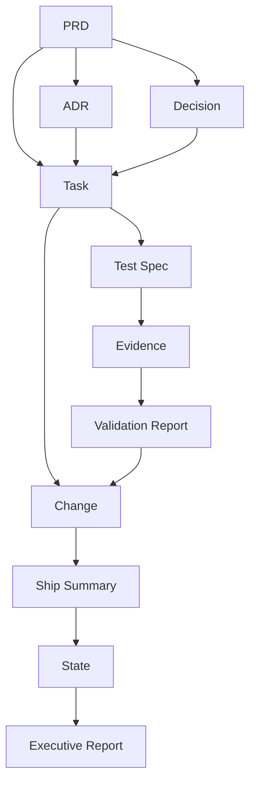

# Template catalog

This catalog is the source of truth for the templates in this kit. Use it to choose the correct document before creating a new artifact.

## Template selection matrix

| Need | Use this template | Output | Usually linked to |
|---|---|---|---|
| Define what should be built and why | `prd-template.md` | Product requirements | ADR, task, test spec, executive report |
| Record an architectural decision | `adr-template.md` | Architecture decision record | PRD, task, change, validation report |
| Record a non-architectural decision | `decision.template.md` | Decision record | PRD, task, executive report |
| Define executable work | `task.template.md` | Task specification | PRD, ADR, evidence, validation report |
| Govern a production or operational change | `change.template.md` | Change record | task, evidence, validation report, ship summary |
| Define how testing will happen | `test-spec-template.md` | Test specification | PRD, task, evidence, validation report |
| Capture objective proof | `evidence.template.md` | Evidence record | test spec, validation report, change |
| Conclude if the release/change is valid | `validation-report-template.md` | Validation report | test spec, evidence, change, ship summary |
| Summarize what actually shipped | `ship-summary-template.md` | Release/ship summary | change, validation report, state report |
| Capture current state | `state.template.md` | State snapshot | ship summary, executive report |
| Update leadership | `executive-report.template.md` | Executive report | state, metrics, risks, validation |

## Recommended artifact flow

## Naming convention

Recommended conventions:

| Artifact | File name pattern |
|---|---|
| PRD | `PRD-0000-short-title.md` |
| ADR | `ADR-0000-short-title.md` |
| Decision | `DEC-0000-short-title.md` |
| Task | `TASK-0000-short-title.md` |
| Test spec | `TST-0000-short-title.md` |
| Evidence | `EVD-0000-short-title.md` |
| Validation report | `VAL-0000-short-title.md` |
| Change | `CHG-0000-short-title.md` |
| Ship summary | `REL-0000-short-title.md` |
| State | `STATE-0000-short-title.md` |
| Executive report | `EXEC-0000-short-title.md` |

## Status values

| Status | Meaning |
|---|---|
| `draft` | Work in progress. Not yet ready for review. |
| `in_review` | Ready for reviewers to challenge content and completeness. |
| `approved` | Accepted as current guidance or record. |
| `shipped` | Delivered to the intended environment or audience. |
| `deprecated` | No longer recommended, retained for history. |
| `superseded` | Replaced by a newer artifact. |

## Minimal traceability expectation

Every document should link to at least one of these:

- A work item: Jira, GitHub Issue, Linear issue, ServiceNow change, or similar.
- A decision source: PRD, ADR, decision record, incident, risk register, or stakeholder request.
- A verification artifact: test spec, evidence, validation report, release note, dashboard, or log.

## Template maturity levels

| Level | Description | Expected usage |
|---|---|---|
| Level 1 | Minimal fields filled | Small internal tasks, low risk |
| Level 2 | Traceability and acceptance criteria filled | Normal engineering work |
| Level 3 | Evidence, rollback, validation, risk, and approvals filled | Production, data, AI, security, or high-impact work |

## Anti-patterns

Avoid these patterns:

- Creating a PRD that is just a task list.
- Creating an ADR after the implementation only to justify what already happened.
- Saying "tests passed" without evidence links.
- Using a change record without a rollback path.
- Shipping without a validation report when risk is medium or high.
- Treating the executive report as a dump of technical details.
- Closing a task without acceptance criteria and evidence.
