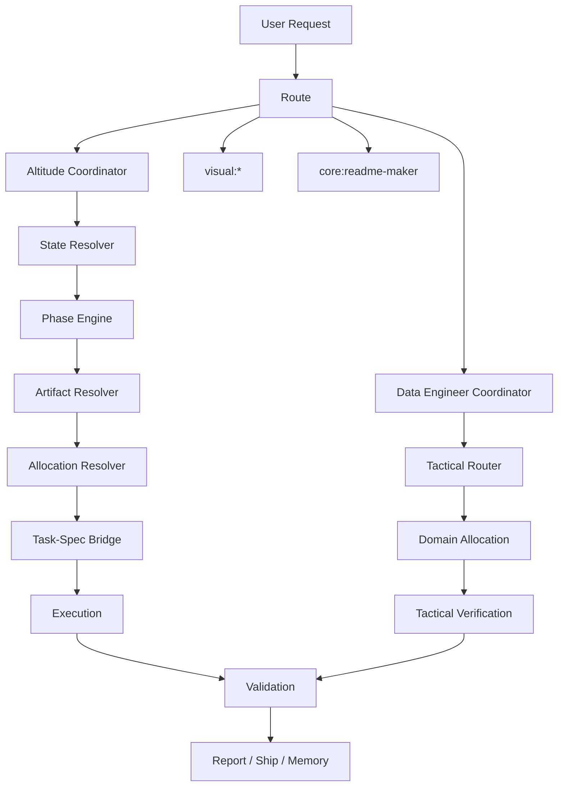

# Harness V3 Architecture

## Purpose

Harness V3 is the target architecture for this OpenCode harness after the `harness-360-refactor` foundation. It replaces overlapping lifecycle ownership with one coordinator-centered model, explicit state resolution, allocation before execution, and fixture-backed migration.

This document is a freeze artifact. It does not mutate runtime behavior by itself.

## Architecture Thesis

The harness should not have multiple surfaces independently deciding phase, scope, task shape, or validation authority.

```text
Old posture:
  AGENTS.md + grounding.md + workflow commands + phase agents + plugins
  each carry partially overlapping lifecycle authority.

V3 posture:
  coordinator selects path
  contracts define behavior
  state resolver determines current phase
  allocation assigns ownership before execution
  Task-Spec owns leaf tasks
  runtime plugins enforce only what they actually implement
```

## Visible Operating Surface

| Surface | V3 role |
| --- | --- |
| `Altitude` | primary strategic coordinator for durable `.specs` work |
| `Data Engineer` | tactical coordinator for bounded data-engineering tasks |
| `visual:*` | retained direct command family for final visual artifacts |
| `core:readme-maker` | retained direct command for README artifacts |
| `workflow:*` | compatibility wrapper only; not an independent lifecycle owner |

## Authority Model

```text
User request
  -> coordinator selection
  -> state resolver
  -> phase or tactical mode
  -> contract loader
  -> artifact resolver
  -> allocation resolver
  -> task generation or task execution
  -> Ralph Loop validation
  -> report, ship, or next gate
```

No execution path is valid unless it can identify:

- active change or tactical task
- governing phase or mode
- allowed files and forbidden scope
- verification commands or manual validation gates
- evidence required
- rollback path

## Coordinator Topology



## Non-Negotiable Invariants

| Invariant | Reason |
| --- | --- |
| Current user instruction wins over old artifacts | prevents stale state from overriding live intent |
| State conflicts block execution | prevents silent phase drift |
| Allocation happens before delegation | prevents execution from inventing task ownership |
| Task-Spec is the leaf-task engine | prevents duplicate task models |
| `.specs/changes` remains the durable change surface | preserves auditability |
| Runtime-critical plugins must enforce or be demoted | prevents no-op architecture |
| Commands are retained only by exception | reduces lifecycle surface area |
| Shared policies live under `.specs/shared` | keeps grounding thin and contract-backed |

## Artifact Families

| Artifact | Purpose |
| --- | --- |
| PRD | requirements, expected behavior, scope, non-goals |
| ADR | architecture decision and trade-off record |
| TEST-SPEC | validation matrix, regression scenarios, evidence requirements |
| validation report | evidence-backed task/change validation |
| ship summary | shipped boundary, residual risks, rollback notes |
| allocation contract | ownership, scope, context, evidence, specialist responsibility |

## Migration Boundary

Harness V3 is not complete until behavior is fixture-tested and runtime surfaces are either enforced or explicitly advisory.

This architecture file authorizes later waves; it does not authorize command removal, plugin rewiring, or runtime blocking without golden fixtures.
