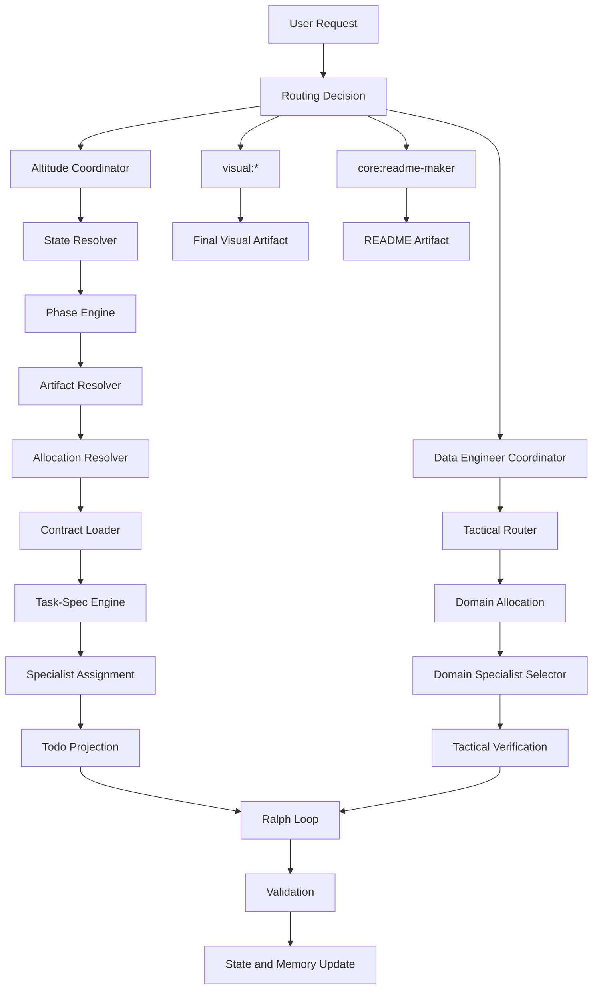

# Harness V3 Refactor Roadmap

## 1. Purpose

Define the complete refactor roadmap for migrating the current OpenCode harness from a split `Altitude + workflow + legacy grounding + command-heavy` model into a coordinator-centered `Harness V3` architecture.

The goal is not only to simplify the visible interface. The goal is to remove competing control planes, make state and phase resolution deterministic, move allocation and delegation earlier, make Task-Spec the official leaf-task engine, preserve useful legacy behavior through tests, and avoid another partially overlapping runtime.

This roadmap is designed for a big-bang architectural migration executed through focused, verifiable waves.

The migration target is a harness where:

```text
- one strategic coordinator owns durable work
- one tactical data-engineering coordinator owns day-to-day data work
- phase movement is contract-driven and human-gated
- artifacts define intent, design, decisions, validation, and shipping evidence
- Task-Spec owns leaf tasks
- allocation is explicit before execution
- delegation is a subset of allocation
- runtime policies are split, enforceable, and testable
- no no-op runtime-critical plugin remains
- command surface is reduced to only the commands that still deserve to exist
```

---

## 2. Grounding

This roadmap is grounded in the current harness surfaces:

```text
AGENTS.md
config/grounding.md
opencode.json
plugins/permission-hardening.ts
plugins/specs-state.ts
plugins/rtk-native.ts
plugins/headroom-guard.ts
sdd/architecture/WORKFLOW_CONTRACTS.yaml
skills/task-spec/SKILL.md
skills/workflow-commands/SKILL.md
agents/workflow.build-agent.agent.md
docs/HARNESS_TARGET_OPERATING_MODEL.md
docs/HARNESS_MCP_GOVERNANCE_MATRIX.md
docs/HARNESS_KB_GOVERNANCE_STANDARD.md
docs/HARNESS_EVOLUTION_TREE.md
skills/data-engineering/
commands/
.specs/shared/
.specs/templates/
```

---

## 3. Target Decisions Snapshot

| Topic                  | Target decision                                                                                                        |
| ---------------------- | ---------------------------------------------------------------------------------------------------------------------- |
| Primary visible agents | Two visible coordinators: `Altitude` for strategic durable work and `Data Engineer` for tactical data-engineering work |
| Strategic path         | Change-oriented, `.specs`-driven, phase-gated                                                                          |
| Tactical path          | Task-oriented, specialist-routed, simple-first implementation                                                          |
| Phase model            | `Intent -> Structure -> Design/Plan -> Execution -> Validate -> Ship`                                                  |
| Phase logic            | Skills + contracts + state resolver, not one visible agent per phase                                                   |
| Phase movement         | Human-gated; coordinator can recommend but not silently advance                                                        |
| Phase resolution       | Current user instruction + task contract + artifacts + machine state + memory                                          |
| Artifact model         | PRD, ADR, TEST-SPEC, validation report, ship summary, phase artifacts                                                  |
| Artifact templates     | Official templates under `.specs/templates/`                                                                           |
| Commands retained      | `core:readme-maker` and `visual:*` only                                                                                |
| Command migration      | Soft-deprecate first, hard-remove after replacement fixtures pass                                                      |
| Leaf-task engine       | `skills/task-spec/` is the official leaf-task engine                                                                   |
| Change-level control   | `.specs/changes/...` remains the durable change surface                                                                |
| Allocation model       | Global allocation defines change/wave/phase ownership; local allocation defines task/todo ownership                    |
| Delegation model       | Delegation is a subset of allocation, not a late execution decision                                                    |
| Code generation        | Simple-first production code                                                                                           |
| Documentation          | Maximum useful detail, not unbounded verbosity                                                                         |
| Ralph Loop             | Mandatory for executable work and critical artifact generation                                                         |
| Grounding              | Thin index that loads split concern policies                                                                           |
| RTK                    | Integrated into runtime core or explicitly removed                                                                     |
| Headroom               | Enforced in runtime or explicitly removed                                                                              |
| Ask-User               | Structured multiple-choice prompts whenever possible                                                                   |
| Todo model             | `Wave -> Task -> Todo`, each operational todo has `verify:` and specialist citation when relevant                      |
| Test strategy          | Golden behavior fixtures before runtime mutation                                                                       |
| Rollback strategy      | Every risky wave has rollback instructions                                                                             |
| Migration posture      | Big-bang target, staged execution with preservation matrix                                                             |

---

## 4. Current Root Causes

### 4.1 Competing control planes

The current harness carries multiple operational authorities:

```text
Altitude         -> wants to own durable work in .specs
Workflow / SDD   -> still owns build/validate/ship semantics
Grounding        -> still controls broad runtime behavior
Commands         -> still expose lifecycle behavior directly
Plugins          -> partially enforce policies, partially no-op
```

This creates ambiguity around:

```text
phase transitions
task generation
validation authority
specialist delegation
documentation behavior
runtime enforcement
command routing
state ownership
allocation ownership
```

The refactor must not simply rename the control plane. It must remove duplicated authorities.

Incorrect target:

```text
Altitude coordinator
Workflow runtime
Task-Spec engine
Grounding monolith
Commands
all still owning pieces of lifecycle behavior
```

Correct target:

```text
Coordinator owns routing and phase behavior
Contracts define required behavior
Task-Spec owns leaf tasks
Runtime plugins enforce runtime constraints
Commands are narrow exceptions
```

---

### 4.2 Delegation is born too late

The best subagent allocation logic still lives inside the workflow build path. That means the system thinks about specialists too late, often after decomposition should already have happened.

Target correction:

```text
Intent / Structure / Design-Plan
  -> task contract
  -> allocation
  -> specialist assignment
  -> evidence requirements
  -> executable task
```

Execution must not invent its own tasking model.

---

### 4.3 Allocation is not explicit enough

The previous roadmap talked about delegation but did not clearly define allocation.

That is a structural gap.

Delegation only answers:

```text
Which specialist should help?
```

Allocation answers:

```text
Who owns the work?
At what scope?
With what authority?
With what context?
With what allowed files?
With what forbidden files?
With what evidence?
With what verification responsibility?
```

Harness V3 must treat allocation as the primary concept.

Delegation becomes a subset of allocation.

---

### 4.4 Grounding is overloaded

`config/grounding.md` currently mixes:

```text
skill priority
command rules
SDD bootstrap
Ralph Loop
token budget
compression policy
language policy
documentation behavior
runtime behavior
Ask-User behavior
todo behavior
```

Target correction:

```text
config/grounding.md = thin index only
shared contracts = source of behavior
runtime plugins = enforcement layer
docs = explanation only
```

---

### 4.5 Runtime enforcement is uneven

Some rules are documented but not enforced. `specs-state.ts` remains a known weak/no-op surface for hard blocking. RTK and Headroom are described as important but not proven active.

Target correction:

```text
No policy is considered real until:
- it is wired into runtime, or
- it is explicitly documented as advisory, or
- it is intentionally removed.
```

---

### 4.6 Command surface is too large

The current repo exposes many commands, but the desired user-facing model is narrow:

```text
Allowed:
- core:readme-maker
- visual:*

Absorbed:
- workflow:*
- data:*
- lifecycle commands
- phase-specific command entrypoints
```

However, commands should not be deleted before their useful behavior is preserved through fixtures.

---

### 4.7 Tactical data-engineering work lacks a coordinator

`skills/data-engineering/` currently behaves more like a command-centered skill surface than a true tactical coordinator path.

Target correction:

```text
Data Engineer coordinator
  -> tactical router
  -> domain specialist selector
  -> verification policy
  -> simple-first code posture
  -> evidence-based response
```

---

### 4.8 State resolution is under-specified

Phase resolution cannot depend on vague language like “artifacts + state combined.”

It must define precedence.

Target correction:

```text
State precedence must be deterministic.
State conflicts must block execution until repaired or confirmed.
```

---

### 4.9 Migration lacks golden tests

Without fixtures, the refactor may remove useful behavior while appearing architecturally clean.

Target correction:

```text
Before mutation:
- capture useful current behavior
- define expected routing
- define expected state
- define expected phase
- define expected todo projection
- define expected verification
```

---

## 5. Target Architecture

### 5.1 Architecture as text

```text
[User request]
  -> [Visible coordinator selection]
      -> Altitude Coordinator
      -> Data Engineer Coordinator
      -> visual:* command
      -> core:readme-maker command
  -> [State resolver]
  -> [Phase or tactical mode detection]
  -> [Policy and contract loader]
  -> [Artifact resolver]
  -> [Allocation resolver]
  -> [Task-Spec or .specs task generation]
  -> [Specialist allocation when justified]
  -> [Todo projection]
  -> [Ralph Loop if executable]
  -> [Validation]
  -> [State and memory update]
  -> [Ship, next task, or next phase recommendation]
```

---

### 5.2 Coordinator topology



---

## 6. Final Runtime Model

```text
HARNESS V3
├── visible coordinator: Altitude
│   ├── strategic request classifier
│   ├── state resolver
│   ├── phase engine
│   ├── artifact resolver
│   ├── memory engine
│   ├── allocation resolver
│   ├── task engine
│   ├── Task-Spec bridge
│   ├── delegation engine
│   ├── execution policy engine
│   ├── Ask-User engine
│   ├── Todo projection engine
│   └── mode engine
│
├── visible coordinator: Data Engineer
│   ├── tactical request classifier
│   ├── tactical router
│   ├── tactical allocation resolver
│   ├── domain specialist selector
│   ├── verification and evidence policy
│   ├── Ralph Loop for executable work
│   └── simple-first production code posture
│
├── retained command surface
│   ├── core:readme-maker
│   └── visual:*
│
├── artifact system
│   ├── PRD
│   ├── ADR
│   ├── TEST-SPEC
│   ├── validation report
│   ├── ship summary
│   └── phase artifacts
│
├── allocation system
│   ├── global allocation
│   ├── local allocation
│   ├── specialist allocation
│   └── Task-Spec allocation inheritance
│
├── shared contracts
│   ├── runtime-policy
│   ├── context-loading-policy
│   ├── state-resolution-contract
│   ├── phase-engine-contract
│   ├── allocation-contract
│   ├── global-allocation-contract
│   ├── local-allocation-contract
│   ├── execution-loop-contract
│   ├── task-contract
│   ├── specialist-allocation-contract
│   ├── ask-user-policy
│   ├── todo-allocation-contract
│   ├── documentation-mode-policy
│   └── production-code-mode-policy
│
└── runtime enforcement
    ├── permission-hardening
    ├── specs-state
    ├── RTK
    └── Headroom
```

---

# 7. Coordinator Contract

Create:

```text
docs/HARNESS_V3_COORDINATOR_CONTRACT.md
```

## 7.1 Request lifecycle

Every coordinator request follows this lifecycle:

```text
1. classify request
2. select coordinator path
3. resolve active state
4. resolve phase or tactical mode
5. resolve governing artifacts
6. resolve global/local allocation
7. load minimum required context
8. decide action type
9. ask user when blocked
10. generate or update task contract
11. allocate specialists when justified
12. project todos
13. execute only if explicitly authorized
14. run Ralph Loop when executable
15. validate
16. update state and memory
17. recommend next gate
```

---

## 7.2 Request classification

```text
strategic durable work:
- architecture refactor
- roadmap
- system design
- multi-step change
- `.specs` change
- PRD/ADR/TEST-SPEC/architecture plan

tactical data-engineering work:
- SQL/dbt fixes
- schema design
- data-quality issue
- pipeline failure
- migration
- Fabric/GCP/Airflow/Dataform task
- code review for data pipelines

visual artifact:
- architecture diagram
- visual explainer
- final documentation visual
- presentation-quality diagram

readme artifact:
- README generation/update

unknown:
- ask structured clarification
```

---

## 7.3 Coordinator action types

```text
answer_only:
- no durable state mutation
- no file mutation
- no phase movement

ask_user:
- ambiguity blocks correctness
- phase transition requires human gate
- execution requires explicit task selection
- local allocation attempts to broaden global allocation

create_or_update_artifact:
- roadmap, PRD, ADR, TEST-SPEC, contract, spec, design doc

create_or_update_task:
- Task-Spec leaf task
- .specs task pack
- tactical task contract

execute_task:
- only after explicit user instruction

validate:
- verify task, artifact, code, migration, or state

ship:
- final summary, evidence, next phase recommendation
```

---

# 8. State Resolution Contract

Create:

```text
docs/HARNESS_V3_STATE_RESOLUTION_CONTRACT.md
.specs/shared/state-conflict-resolution-policy.md
```

## 8.1 State authority order

```text
1. explicit user instruction in current turn
2. active task contract
3. active local allocation
4. active wave allocation
5. active phase allocation
6. active change request contract
7. durable artifacts in `.specs/changes/...`
8. machine-readable state file
9. memory notes
10. inferred repository context
```

---

## 8.2 Conflict handling

If sources conflict, the coordinator must not silently proceed.

Example:

```text
Artifact says: phase = Structure
Machine state says: phase = Execution
Last task says: validation incomplete
```

Required behavior:

```text
1. detect conflict
2. summarize conflict
3. recommend repair option
4. ask user to confirm
5. block execution until resolved
```

---

## 8.3 State conflict output format

```text
State conflict detected.

Current evidence:
- artifact state:
- machine state:
- task state:
- inferred state:

Recommended repair:
A. trust artifact state
B. trust machine state
C. reset to earlier phase
D. create repair task

Required confirmation:
Choose A/B/C/D.
```

---

# 9. Phase Engine Contract

Create:

```text
docs/HARNESS_V3_PHASE_ENGINE_SPEC.md
.specs/shared/phase-engine-contract.md
```

## 9.1 Phase model

```text
Intent
  -> define problem, goal, constraints, non-goals, stakeholders

Structure
  -> map repo, modules, contracts, dependencies, risks

Design/Plan
  -> define requirements, architecture, task packs, allocation, test strategy, acceptance gates

Execution
  -> execute one approved task or approved task batch

Validate
  -> verify implementation, evidence, tests, acceptance criteria

Ship
  -> summarize change, document evidence, update memory, recommend next wave
```

---

## 9.2 Human gates

```text
Intent -> Structure:
- user confirms problem and scope

Structure -> Design/Plan:
- user confirms architecture surface and constraints

Design/Plan -> Execution:
- user selects task or task batch

Execution -> Validate:
- automatic after task execution, unless blocked

Validate -> Ship:
- allowed only when acceptance criteria pass or known gaps are documented

Ship -> next phase/wave:
- user confirms continuation
```

---

## 9.3 Phase Artifact Contract

The phase artifact contract must not rely only on ADRs. ADRs explain architecture decisions, but they do not fully cover product intent, requirements, validation strategy, regression scenarios, test evidence, or acceptance criteria.

Harness V3 uses three primary planning artifact families:

```text
PRD       -> defines product/problem requirements and expected behavior
ADR       -> records architectural or technical decisions
TEST-SPEC -> defines validation, test strategy, regression scenarios, and evidence
```

These artifacts are not mandatory for every request. They are mandatory when the work reaches enough complexity, risk, durability, or stakeholder impact.

---

### 9.3.1 Artifact selection rule

Use PRD when:

```text
- the change affects user behavior, business process, product capability, workflow, or requirement semantics
- there are stakeholders, acceptance criteria, non-goals, or scope boundaries
- the work needs alignment before design or execution
- the implementation could be correct technically but wrong functionally
```

Use ADR when:

```text
- the change introduces or changes architecture
- there are meaningful technical alternatives
- a trade-off must be recorded
- the decision should remain understandable after implementation
- future maintainers need to know why the option was chosen
```

Use TEST-SPEC when:

```text
- the change requires validation beyond casual inspection
- data correctness, regression, migration, runtime behavior, permissions, or workflow behavior may break
- fixtures, test cases, acceptance checks, or evidence are needed
- the ship decision depends on verifiable proof
```

---

### 9.3.2 Updated phase artifact table

| Phase       | Required outputs                    | Conditional outputs                            | Purpose                                                                                            |
| ----------- | ----------------------------------- | ---------------------------------------------- | -------------------------------------------------------------------------------------------------- |
| Intent      | `00-intent.md`                      | PRD draft                                      | Define problem, goal, non-goals, stakeholders, assumptions, and success shape                      |
| Structure   | `01-structure.md`                   | requirement impact map, system map             | Map repo, modules, dependencies, existing contracts, risks, and affected surfaces                  |
| Design/Plan | `02-plan.md`, task pack             | PRD, ADR, TEST-SPEC, global allocation         | Define what will be built, why, how, alternatives, allocation, test strategy, and acceptance gates |
| Execution   | task evidence, implementation notes | local ADR update, test notes, local allocation | Execute one approved task or approved batch with evidence                                          |
| Validate    | validation report                   | TEST-SPEC results, regression matrix           | Prove behavior against acceptance criteria and risk scenarios                                      |
| Ship        | ship summary                        | final PRD/ADR/TEST-SPEC links, changelog       | Close the wave, record evidence, update state and memory                                           |

---

### 9.3.3 Phase artifact rules

Intent:

```text
- PRD may start as draft when requirements are still unclear.
- ADR is usually not created yet.
- TEST-SPEC is usually not created yet, but validation concerns may be listed.
- Global allocation may be sketched if ownership is already obvious.
```

Structure:

```text
- PRD may be refined with constraints discovered from the repo.
- ADR candidates may be listed but not finalized.
- TEST-SPEC risks may be identified.
- Affected surfaces should be mapped before allocation becomes strict.
```

Design/Plan:

```text
- PRD becomes required for durable product/workflow changes.
- ADR becomes required for architectural decisions.
- TEST-SPEC becomes required for executable work with regression risk.
- Global allocation becomes required for multi-wave or multi-specialist work.
- Task pack must cite which artifacts govern execution.
```

Execution:

```text
- Local task contracts may reference PRD, ADR, and TEST-SPEC.
- Local allocation becomes required for executable work.
- Any implementation that violates a governing artifact must stop and request a decision.
```

Validate:

```text
- TEST-SPEC becomes the primary validation authority.
- Validation report must map evidence back to TEST-SPEC cases and acceptance criteria.
```

Ship:

```text
- Ship summary must link final PRD, ADRs, TEST-SPEC results, task evidence, known gaps, and next recommended wave.
```

---

## 9.4 Artifact Template Catalog

Create:

```text
docs/HARNESS_V3_ARTIFACT_TEMPLATE_CATALOG.md
.specs/templates/prd-template.md
.specs/templates/adr-template.md
.specs/templates/test-spec-template.md
.specs/templates/validation-report-template.md
.specs/templates/ship-summary-template.md
```

---

### 9.4.1 PRD template

Path:

```text
.specs/templates/prd-template.md
```

Purpose:

```text
Define the product, workflow, business, or user-facing requirement that the change must satisfy.
```

Template:

```markdown
# PRD: <Title>

## 1. Problem

What problem exists today?

## 2. Goal

What outcome should this change produce?

## 3. Non-goals

What is explicitly outside the scope?

## 4. Stakeholders

Who is affected by this change?

## 5. Current behavior

How does the system or workflow behave today?

## 6. Desired behavior

How should it behave after the change?

## 7. Requirements

### Functional requirements

- FR-001:
- FR-002:

### Non-functional requirements

- NFR-001:
- NFR-002:

## 8. Acceptance criteria

- AC-001:
- AC-002:

## 9. Constraints

Technical, business, operational, security, governance, cost, or compatibility constraints.

## 10. Open questions

Questions that block design or execution.

## 11. Out-of-scope risks

Known concerns that will not be solved in this change.

## 12. Links

Related ADRs, TEST-SPEC, task packs, issues, docs, or code references.
```

---

### 9.4.2 ADR template

Path:

```text
.specs/templates/adr-template.md
```

Purpose:

```text
Record a technical or architectural decision and its consequences.
```

Template:

```markdown
# ADR-<number>: <Decision title>

## Status

Proposed | Accepted | Superseded | Deprecated

## Context

What situation forced this decision?

## Decision

What did we decide?

## Options considered

### Option A

Description, benefits, drawbacks.

### Option B

Description, benefits, drawbacks.

### Option C

Description, benefits, drawbacks.

## Rationale

Why is the selected option better for this context?

## Consequences

### Positive consequences

### Negative consequences

### Operational consequences

### Migration consequences

## Compatibility impact

What existing behavior, API, command, config, or workflow may be affected?

## Validation

How will we prove this decision was implemented correctly?

## Links

Related PRD, TEST-SPEC, implementation task, or validation report.
```

---

### 9.4.3 TEST-SPEC template

Path:

```text
.specs/templates/test-spec-template.md
```

Purpose:

```text
Define the validation strategy, test cases, regression scenarios, fixtures, commands, and evidence required before shipping.
```

Template:

```markdown
# TEST-SPEC: <Title>

## 1. Scope

What behavior, files, commands, workflows, or contracts are being validated?

## 2. Validation objective

What must be proven?

## 3. Acceptance criteria mapping

| Acceptance criterion | Test case | Evidence |
|---|---|---|

## 4. Test strategy

Unit, integration, fixture, static validation, manual validation, runtime validation, or golden behavior comparison.

## 5. Golden fixtures

| Fixture | Input | Expected behavior |
|---|---|---|

## 6. Regression scenarios

What must not break?

## 7. Negative scenarios

What invalid, ambiguous, unsafe, or conflicting inputs must be handled?

## 8. Data scenarios

Relevant datasets, schemas, records, edge cases, or mocked data.

## 9. Commands or checks

Commands, scripts, manual checks, or review steps used to validate.

## 10. Evidence required

Logs, output files, screenshots, generated artifacts, test reports, or diffs.

## 11. Pass/fail criteria

What qualifies as pass, partial pass, or fail?

## 12. Known gaps

What remains untested and why?

## 13. Links

Related PRD, ADRs, task pack, implementation evidence, and validation report.
```

---

### 9.4.4 Validation report template

Path:

```text
.specs/templates/validation-report-template.md
```

Purpose:

```text
Record validation evidence after execution and before shipping.
```

Template:

```markdown
# Validation Report: <Title>

## 1. Validation summary

Pass | Partial pass | Fail

## 2. Scope validated

What was validated?

## 3. Evidence reviewed

| Evidence | Source | Result |
|---|---|---|

## 4. TEST-SPEC mapping

| Test case | Expected | Actual | Result |
|---|---|---|---|

## 5. Acceptance criteria mapping

| Acceptance criterion | Evidence | Result |
|---|---|---|

## 6. Regression check

What existing behavior was checked?

## 7. Known gaps

What was not validated?

## 8. Risks remaining

What could still fail?

## 9. Recommendation

Ship | Fix before ship | Return to execution | Return to design

## 10. Links

Related PRD, ADR, TEST-SPEC, task evidence, or commit.
```

---

### 9.4.5 Ship summary template

Path:

```text
.specs/templates/ship-summary-template.md
```

Purpose:

```text
Close a wave, task pack, or change with evidence, decisions, and next steps.
```

Template:

```markdown
# Ship Summary: <Title>

## 1. Outcome

What changed?

## 2. Scope completed

What was completed?

## 3. Scope not completed

What remains out of scope or deferred?

## 4. Artifacts produced

| Artifact | Path | Purpose |
|---|---|---|

## 5. Decisions recorded

| ADR | Decision |
|---|---|

## 6. Validation evidence

| Evidence | Result |
|---|---|

## 7. Known gaps

What risks or limitations remain?

## 8. State update

What phase, wave, task, or memory state changed?

## 9. Rollback notes

How can this be reversed?

## 10. Recommended next action

Next phase, next wave, next task, or stop.
```

---

# 10. Artifact Authority Registry

Create:

```text
docs/HARNESS_V3_ARTIFACT_REGISTRY.md
```

## 10.1 Rule

Every important artifact must have a clear authority boundary.

If an artifact does not own anything, it is either explanatory documentation or should not exist.

## 10.2 Registry format

```text
Artifact | Owns | Consumed by | Mutated by | Deprecated by
```

Example:

| Artifact | Owns | Consumed by | Mutated by | Deprecated by |
|---|---|---|---|
| `AGENTS.md` | top-level agent behavior | runtime, humans | coordinator migration | never, but rewritten |
| `config/grounding.md` | grounding index only | coordinator | grounding split | old monolith |
| `.specs/shared/task-contract.md` | task schema | Task-Spec, coordinator | Task-Spec integration | never |
| `.specs/shared/allocation-contract.md` | allocation model | coordinator, Task-Spec, todo engine | Wave 3B | never |
| `.specs/templates/prd-template.md` | PRD shape | phase engine | artifact template wave | never |
| `.specs/templates/adr-template.md` | ADR shape | phase engine | artifact template wave | never |
| `.specs/templates/test-spec-template.md` | validation planning shape | validation engine | artifact template wave | never |
| `WORKFLOW_CONTRACTS.yaml` | legacy workflow semantics | migration only | unified phase contract | Wave 11 |
| `skills/task-spec/SKILL.md` | leaf-task engine | coordinator | Wave 6 | never |
| `skills/data-engineering/` | tactical routing knowledge | Data Engineer coordinator | Wave 2A | commands replaced |

---

# 11. Shared Contracts and Policies

## 11.1 Target contract layout

```text
config/grounding.md
  -> thin index only

.specs/shared/runtime-policy.md
.specs/shared/context-loading-policy.md
.specs/shared/state-resolution-contract.md
.specs/shared/state-conflict-resolution-policy.md
.specs/shared/phase-engine-contract.md
.specs/shared/allocation-contract.md
.specs/shared/global-allocation-contract.md
.specs/shared/local-allocation-contract.md
.specs/shared/execution-loop-contract.md
.specs/shared/documentation-mode-policy.md
.specs/shared/production-code-mode-policy.md
.specs/shared/compatibility-policy.md
.specs/shared/ask-user-policy.md
.specs/shared/todo-allocation-contract.md
.specs/shared/specialist-allocation-contract.md
.specs/shared/task-contract.md
```

---

## 11.2 Policy versus contract distinction

```text
Policy:
- describes principles, defaults, and preferred behavior

Contract:
- defines required behavior, schema, gates, and acceptance rules

Runtime:
- enforces or operationalizes the policy/contract

Documentation:
- explains usage and maintenance
```

---

# 12. Allocation Model

Create:

```text
.specs/shared/allocation-contract.md
.specs/shared/global-allocation-contract.md
.specs/shared/local-allocation-contract.md
```

Optional per-change artifacts:

```text
.specs/changes/<change-id>/allocation/global-allocation.md
.specs/changes/<change-id>/allocation/wave-<n>-allocation.md
.specs/changes/<change-id>/tasks/<task-id>/local-allocation.md
```

---

## 12.1 Allocation versus delegation

Allocation is the primary model.

Delegation is a subset of allocation.

```text
Allocation:
- owns scope, context, authority, evidence, and verification

Delegation:
- assigns specialist work inside an allocation
```

Correct model:

```text
Global allocation
  -> defines available specialists and boundaries

Local allocation
  -> assigns one task to one owner/specialist

Delegation
  -> happens inside local allocation
```

Incorrect model:

```text
Execution starts
  -> coordinator decides ad hoc to call specialists
  -> no scope
  -> no evidence contract
  -> no verification owner
```

---

## 12.2 Global allocation

Global allocation defines ownership and specialist strategy for a whole repository, change, wave, or phase.

It answers:

```text
Who owns the change?
Which coordinator owns the route?
Which specialists are globally available?
Which artifacts are authoritative?
Which context bundles are allowed?
Which verification strategy applies globally?
Which files or surfaces are globally in scope?
Which files or surfaces are forbidden?
Which risks require escalation?
```

### 12.2.1 Global allocation levels

```text
Repository default allocation
  -> default specialists and policies for the repo

Change allocation
  -> specialists and owners for a full .specs change

Wave allocation
  -> specialists and owners for one migration wave

Phase allocation
  -> specialists and owners for Intent, Structure, Design/Plan, Execution, Validate, or Ship
```

### 12.2.2 Global allocation template

```markdown
# Global Allocation: <change-id or wave-id>

## 1. Scope

Repository | Change | Wave | Phase

## 2. Primary coordinator

Altitude | Data Engineer

## 3. Global owner

Who owns coherence and final synthesis?

## 4. Authoritative artifacts

- PRD:
- ADRs:
- TEST-SPEC:
- Phase contract:
- Task contract:

## 5. Global specialists

| Specialist | Reason | Scope | Can modify files? | Evidence required |
|---|---|---|---|---|

## 6. Global context bundles

| Bundle | Purpose | Files/artifacts | Load condition |
|---|---|---|---|

## 7. Global allowed scope

Files, directories, commands, configs, docs, or runtime surfaces globally allowed.

## 8. Global forbidden scope

Files, directories, commands, configs, docs, or runtime surfaces forbidden unless explicitly approved.

## 9. Global verification policy

Default verification expectations for this allocation.

## 10. Escalation rules

When must the coordinator stop and ask the user?

## 11. Rollback policy

How to reverse this allocation or return to the previous control model.
```

---

## 12.3 Local allocation

Local allocation defines ownership and specialist behavior for one task, subtask, or todo.

It answers:

```text
Who owns this exact task?
Which specialist is assigned locally?
Which files can be touched?
Which files are forbidden?
What context is loaded for this task only?
What verification must be produced?
What evidence closes this task?
```

### 12.3.1 Local allocation levels

```text
Task allocation
  -> one Task-Spec leaf task

Todo allocation
  -> one operational todo inside a task

Validation allocation
  -> one specialist or validator assigned to verify evidence
```

### 12.3.2 Local allocation template

```markdown
# Local Allocation: <task-id>

## 1. Parent

Change:
Wave:
Phase:
Task:

## 2. Local owner

Coordinator or specialist responsible for the task.

## 3. Assigned specialist

Name:
Reason:
Can modify files: true | false

## 4. Allowed files

Files or directories this task may read or modify.

## 5. Forbidden files

Files or directories this task must not touch.

## 6. Required context

The minimum context needed for this task.

## 7. Inputs

Artifacts, code, logs, schemas, configs, or user decisions required.

## 8. Outputs

Expected files, docs, code changes, reports, or evidence.

## 9. Verification

Concrete checks required before task closure.

## 10. Evidence

What must be attached, cited, or summarized.

## 11. Rollback

How to reverse the local change if validation fails.

## 12. Completion gate

Who or what confirms this task is complete?
```

---

## 12.4 Allocation precedence

Allocation precedence must be deterministic.

```text
1. Explicit user instruction in current turn
2. Local task allocation
3. Wave allocation
4. Phase allocation
5. Change-level global allocation
6. Repository default allocation
7. Coordinator default behavior
```

A local allocation may narrow global allocation without extra approval.

Example:

```text
Global allowed scope:
- agents/
- docs/
- .specs/shared/

Local task allowed scope:
- docs/HARNESS_V3_COORDINATOR_CONTRACT.md
```

This is safe.

A local allocation must not broaden global allocation without explicit approval.

Example:

```text
Global allowed scope:
- docs/

Local task tries to modify:
- plugins/specs-state.ts
```

This must stop and ask the user.

---

## 12.5 Global versus local allocation example

### Global allocation example

```text
Change:
Harness V3 migration

Primary coordinator:
Altitude

Global specialists:
- task-spec specialist
- runtime/plugin specialist
- documentation specialist
- data-engineering specialist

Global allowed scope:
- docs/
- .specs/shared/
- .specs/templates/
- agents/
- skills/task-spec/
- skills/data-engineering/

Global forbidden scope:
- command deletion before Wave 1B
- plugin runtime mutation before Wave 10
- hard removal of workflow surfaces before legacy preservation fixtures pass
```

### Local allocation example

```text
Task:
Create PRD template

Parent wave:
Wave 3B - Artifact Templates and Allocation Contracts

Local owner:
Altitude coordinator

Assigned specialist:
documentation specialist

Allowed files:
- .specs/templates/prd-template.md
- docs/HARNESS_V3_ARTIFACT_TEMPLATE_CATALOG.md

Forbidden files:
- opencode.json
- plugins/
- commands/

Verification:
- template includes problem, goal, non-goals, requirements, acceptance criteria, constraints, open questions, and links
- template is referenced by phase artifact contract
```

---

## 12.6 Allocation and Todo projection

Todo projection must include allocation data.

Updated todo format:

```yaml
todo:
  wave:
  task:
  action:
  allocation_scope: global | local
  owner:
  specialist:
  allowed_files:
  forbidden_files:
  verify:
  evidence:
  status:
```

Example:

```text
Wave 3B - Artifact Templates and Allocation Contracts
  Task 3B.1 - Add PRD/ADR/TEST-SPEC artifact contract
    Todo:
      allocation_scope: local
      owner: Altitude
      specialist: documentation specialist
      allowed_files:
        - docs/HARNESS_V3_PHASE_ENGINE_SPEC.md
        - .specs/templates/prd-template.md
        - .specs/templates/adr-template.md
        - .specs/templates/test-spec-template.md
      forbidden_files:
        - plugins/
        - commands/
      verify:
        - phase artifact table includes PRD, ADR, and TEST-SPEC
        - each template has purpose, required sections, and links
      evidence:
        - changed artifact contract
        - created templates
```

---

## 12.7 Allocation and Task-Spec integration

Task-Spec leaf tasks must inherit allocation context.

Mapping:

| Allocation field | Task-Spec field     |
| ---------------- | ------------------- |
| global owner     | parent_owner        |
| local owner      | task_owner          |
| specialist       | required_specialist |
| allowed files    | allowed_files       |
| forbidden files  | forbidden_files     |
| context bundle   | required_context    |
| verification     | verify_steps        |
| evidence         | evidence_required   |
| rollback         | rollback_plan       |

Rule:

```text
Task-Spec may consume global allocation.
Task-Spec must define local allocation.
Task-Spec cannot silently broaden global allocation.
```

---

## 12.8 Allocation exit criteria

Allocation model is complete when:

```text
- global allocation contract exists
- local allocation contract exists
- allocation precedence is explicit
- local allocation can narrow global allocation
- local allocation cannot broaden global allocation without approval
- todos include allocation scope
- Task-Spec inherits allocation context
- delegation is treated as part of allocation, not a separate late behavior
```

---

# 13. Task-Spec Integration Contract

Create:

```text
docs/HARNESS_V3_TASK_SPEC_INTEGRATION.md
```

## 13.1 Role of Task-Spec

`skills/task-spec/` becomes the official leaf-task engine.

`.specs/changes/...` remains the change-level control surface.

Task-Spec must not become a second control plane.

Correct relationship:

```text
.specs change contract
  -> phase engine
  -> global allocation
  -> task pack
  -> local allocation
  -> Task-Spec leaf task
  -> execution
  -> validation evidence
  -> state update
```

Incorrect relationship:

```text
.specs task model
Task-Spec task model
workflow task model
all competing
```

---

## 13.2 Change-level to Task-Spec mapping

| Change-level field    | Task-Spec field                     |
| --------------------- | ----------------------------------- |
| `change_id`           | `parent_change_id`                  |
| `phase`               | `source_phase`                      |
| `objective`           | `task_goal`                         |
| `scope`               | `allowed_files` / `forbidden_files` |
| `risks`               | `risk_notes`                        |
| `acceptance_criteria` | `acceptance_checks`                 |
| `verification`        | `verify_steps`                      |
| `specialists`         | `required_specialists`              |
| `evidence`            | `evidence_required`                 |
| `rollback`            | `rollback_plan`                     |
| `dependencies`        | `blocked_by`                        |
| `wave`                | `execution_wave`                    |
| `global_allocation`   | `parent_allocation`                 |
| `local_allocation`    | `task_allocation`                   |
| `PRD`                 | `requirements_source`               |
| `ADR`                 | `decision_source`                   |
| `TEST-SPEC`           | `validation_source`                 |

---

## 13.3 Task-Spec generation rule

A Task-Spec leaf task may only be generated when the coordinator knows:

```text
- parent change or tactical request
- phase or tactical mode
- task objective
- allowed files
- forbidden files
- required context
- required evidence
- verification path
- rollback path
- allocation owner
```

If any of those fields are unknown, the coordinator must either infer safely or ask the user.

---

# 14. Specialist Allocation Contract

Create:

```text
.specs/shared/specialist-allocation-contract.md
```

## 14.1 Delegate only when

```text
- task requires specialized domain reasoning
- independent review materially reduces risk
- implementation touches multiple concern areas
- parallel discovery reduces uncertainty
- validation requires a different perspective
```

---

## 14.2 Do not delegate when

```text
- task is small and local
- specialist would only restate coordinator logic
- context cost is higher than expected benefit
- task can be safely handled by one agent
- no evidence requirement exists for the specialist
```

---

## 14.3 Specialist allocation format

```yaml
specialist:
  name:
  reason:
  allowed_files:
  forbidden_files:
  evidence_required:
  can_modify_files: true | false
  verification_responsibility:
  rollback_responsibility:
```

---

## 14.4 Allocation timing

Specialist allocation must happen during decomposition, global allocation, local allocation, or task contract creation.

It must not appear for the first time during execution.

---

# 15. Ask-User Policy

Create:

```text
.specs/shared/ask-user-policy.md
```

## 15.1 Default

Use structured multiple-choice prompts whenever possible.

---

## 15.2 Ask only when

```text
- execution requires explicit authorization
- phase transition needs confirmation
- ambiguity blocks correctness
- state conflict exists
- destructive operation is proposed
- scope expansion is requested
- local allocation attempts to broaden global allocation
```

---

## 15.3 Avoid asking when

```text
- a safe best-effort answer is possible
- the user already gave the answer
- the question is only a preference and does not block correctness
- the task is analysis-only and non-mutating
```

---

## 15.4 Ask format

```text
I found a decision point.

A. Option one — trade-off
B. Option two — trade-off
C. Option three — trade-off

Recommended: B, because ...
```

---

# 16. Todo Allocation Contract

Create:

```text
.specs/shared/todo-allocation-contract.md
```

## 16.1 Todo hierarchy

```text
Wave
└── Task
    └── Todo
        └── verify:
```

---

## 16.2 Required fields

```yaml
todo:
  wave:
  task:
  action:
  allocation_scope: global | local
  owner:
  specialist:
  allowed_files:
  forbidden_files:
  verify:
  evidence:
  status:
```

---

## 16.3 Example

```text
Wave 6 - Task-Spec Integration
  Task 6.1 - Map .specs task contract to Task-Spec schema
    Todo:
      allocation_scope: local
      owner: Altitude
      specialist: task-spec specialist
      allowed_files:
        - docs/HARNESS_V3_TASK_SPEC_INTEGRATION.md
        - .specs/shared/task-contract.md
      forbidden_files:
        - plugins/
        - commands/
      verify:
        - fixture strategic-change-request generates valid leaf task
      evidence:
        - generated task contract path
```

---

# 17. Ralph Loop Contract

Create:

```text
.specs/shared/execution-loop-contract.md
```

## 17.1 Mandatory for

```text
- code generation
- code edits
- config edits
- plugin changes
- command removal
- Task-Spec integration
- critical artifact generation
- validation work
```

---

## 17.2 Advisory for

```text
- pure discovery
- initial ideation
- non-mutating explanation
```

---

## 17.3 Ralph Loop shape

```text
1. Restate task
2. Identify constraints
3. Plan minimal change
4. Execute
5. Verify
6. Evaluate against acceptance criteria
7. Repair if needed
8. Record evidence
9. Update state
```

---

# 18. Documentation Mode Policy

Create:

```text
.specs/shared/documentation-mode-policy.md
```

## 18.1 Corrected rule

Documentation is not “maximum detail” blindly. It is maximum useful detail.

The goal is to avoid shallow documentation without creating bloated, repetitive, unbounded documents.

---

## 18.2 Required section depth

Every major documentation section should answer:

```text
What is this?
Why does it exist?
How does it work?
Where does it apply?
What can go wrong?
How is it validated?
Concrete example
```

---

## 18.3 Required visual behavior

Use Mermaid when:

```text
- flow matters
- architecture matters
- state transition matters
- dependency matters
- lifecycle matters
```

Use SVG or `visual:*` when:

```text
- final artifact needs presentation quality
- Mermaid is insufficient
- audience needs a polished visual
```

---

# 19. Production Code Mode Policy

Create:

```text
.specs/shared/production-code-mode-policy.md
```

## 19.1 Rule

Production code starts simple and correct.

Complexity is allowed only when justified by:

```text
- scale
- reliability
- safety
- maintainability
- performance
- integration constraints
```

---

## 19.2 Required posture

```text
- small surface area
- explicit error handling
- secure defaults
- readable names
- minimal abstraction
- tests or verification path
- no premature frameworking
```

---

# 20. RTK and Headroom Runtime Criteria

Create:

```text
docs/HARNESS_V3_RUNTIME_INTEGRATION.md
```

## 20.1 RTK is active when

```text
- opencode runtime loads RTK plugin/config
- test request proves RTK context is available
- coordinator can state whether RTK context was used
- failure mode is explicit when RTK is unavailable
- runtime docs match actual config
```

---

## 20.2 Headroom is active when

```text
- context budget is computed before heavy work
- loading strategy changes when budget is unsafe
- warnings can block execution when configured
- compression is traceable
- coordinator records when context was compressed or omitted
```

---

## 20.3 If not active

The architecture must explicitly choose one:

```text
A. implement now
B. keep advisory only
C. remove from architecture
```

No more “important but no-op” plugin surfaces.

---

# 21. Legacy Preservation Matrix

Create:

```text
docs/HARNESS_V3_LEGACY_PRESERVATION_MATRIX.md
```

| Legacy surface        | Useful behavior                                  | New owner                                      | Fixture                       | Removal wave |
| --------------------- | ------------------------------------------------ | ---------------------------------------------- | ----------------------------- | ------------ |
| `workflow:build`      | decomposition, task packs, specialist allocation | Coordinator + Task-Spec + allocation contracts | `fixture-strategic-build.md`  | Wave 11 / 1B |
| `workflow:validate`   | validation gates, acceptance checking            | Ralph Loop + TEST-SPEC + validation contract   | `fixture-validation.md`       | Wave 11 / 1B |
| `workflow:ship`       | final summary, evidence, closeout                | Ship phase contract                            | `fixture-ship.md`             | Wave 11 / 1B |
| `/data:*` commands    | tactical data routing                            | Data Engineer coordinator                      | `fixture-data-sql.md`         | Wave 1B      |
| `config/grounding.md` | runtime policies                                 | split shared policies                          | `fixture-context-loading.md`  | Wave 4       |
| phase agents          | phase reasoning                                  | Altitude phase engine                          | `fixture-phase-resolution.md` | Wave 11      |
| `rtk-native.ts`       | RTK intent                                       | runtime integration                            | `fixture-rtk.md`              | Wave 10      |
| `headroom-guard.ts`   | context budget warning                           | Headroom enforcement                           | `fixture-headroom.md`         | Wave 10      |

---

# 22. Golden Behavior Fixtures

Create:

```text
docs/HARNESS_V3_MIGRATION_TEST_PLAN.md
test/fixtures/harness-v3/
```

## 22.1 Required fixtures

```text
fixture-01-strategic-new-change.md
fixture-02-resume-existing-change.md
fixture-03-state-conflict.md
fixture-04-tactical-sql-fix.md
fixture-05-data-quality-investigation.md
fixture-06-documentation-generation.md
fixture-07-visual-artifact-request.md
fixture-08-readme-generation.md
fixture-09-command-deprecation.md
fixture-10-task-spec-leaf-generation.md
fixture-11-specialist-allocation.md
fixture-12-headroom-budget.md
fixture-13-rtk-context.md
fixture-14-prd-generation.md
fixture-15-adr-generation.md
fixture-16-test-spec-generation.md
fixture-17-global-allocation.md
fixture-18-local-allocation.md
```

---

## 22.2 Each fixture must define

```yaml
input_request:
expected_coordinator:
expected_phase:
expected_artifacts:
expected_global_allocation:
expected_local_allocation:
expected_context_loaded:
expected_ask_user_behavior:
expected_task_contract:
expected_specialists:
expected_todos:
expected_verification:
expected_state_update:
```

---

## 22.3 Example fixture

```text
Fixture: tactical SQL fix

Input:
"Fix this dbt model that is duplicating customers."

Expected:
coordinator: Data Engineer
phase: tactical execution
artifacts: no PRD unless user requests durable requirement definition
global allocation: tactical data-engineering default
local allocation: dbt model task allocation
context: dbt model, schema, tests
ask-user: only if target behavior ambiguous
task: Task-Spec leaf task
specialist: dbt/sql specialist if available
todo.verify: run dbt test or equivalent static verification
state update: no durable .specs phase unless user requests strategic change
```

---

# 23. Surfaces That Stay

```text
.specs/changes/...
.specs/memory/...
.specs/shared/...
.specs/templates/...
docs/...
skills/task-spec/
skills/data-engineering/ as tactical routing knowledge
visual:*
core:readme-maker
KB domains and governance
MCP governance
RTK if truly integrated
Headroom if truly integrated
```

---

# 24. Surfaces That Go Away

```text
workflow:* as user-facing lifecycle
agent-per-phase Altitude as primary interface
old SDD/workflow model as operational control plane
most commands/
monolithic config/grounding.md
no-op runtime plugins pretending to enforce behavior
```

---

# 25. Global Rules for V3

## 25.1 One coordinator owns durable work

No durable `.specs` work should be controlled by workflow commands, phase agents, and grounding simultaneously.

## 25.2 Human gates phase movement

The coordinator can recommend phase movement, but the user confirms.

## 25.3 Execution is explicit

Execution only starts after the user explicitly selects a task or task batch.

## 25.4 Memory is transversal

Memory is updated during meaningful iterations. It is not a final phase.

## 25.5 Documentation is maximum useful detail

No shallow docs. No unbounded noise. Each section must teach, justify, and validate.

## 25.6 Code is simple-first

Start with correct, maintainable, production-safe code. Escalate complexity only under justified need.

## 25.7 Ralph Loop applies to executable work

No critical edit, build, validation, or artifact generation should run without loop posture.

## 25.8 Todo projection is hierarchical

Todos derive from wave, task, allocation, and verification state.

## 25.9 Specialist allocation is explicit

No hidden subagent usage. Specialist involvement must be justified and cited in task/todo when relevant.

## 25.10 No no-op architecture

Anything named as runtime-critical must either be enforced, marked advisory, or removed.

---

# 26. Focused Waves

## Wave 0 — Final Architecture Freeze

### Goal

Freeze the final Harness V3 architecture before mutating runtime behavior.

### Main outputs

```text
docs/HARNESS_V3_ARCHITECTURE.md
docs/HARNESS_V3_COORDINATOR_CONTRACT.md
docs/HARNESS_V3_PHASE_ENGINE_SPEC.md
docs/HARNESS_V3_STATE_RESOLUTION_CONTRACT.md
docs/HARNESS_V3_ARTIFACT_REGISTRY.md
```

### Key decisions

```text
- coordinator authority boundaries
- two visible agents
- retained command surface
- removed command surface
- phase model
- state precedence
- artifact ownership
```

### Exit criteria

```text
- coordinator authority is explicit
- state resolution precedence is explicit
- phase transitions are explicit
- artifact ownership is explicit
- retained versus removed surfaces are explicit
```

### Risk

Low.

### Rollback

No runtime mutation. Rollback is document-only.

### Context pack

```text
AGENTS.md
config/grounding.md
opencode.json
.specs/shared/change-request-contract.md
.specs/shared/task-contract.md
skills/task-spec/SKILL.md
docs/HARNESS_TARGET_OPERATING_MODEL.md
```

---

## Wave 0A — Golden Behavior Fixtures

### Goal

Capture useful existing behavior before changing runtime, commands, coordinator behavior, or plugins.

### Main outputs

```text
docs/HARNESS_V3_MIGRATION_TEST_PLAN.md
test/fixtures/harness-v3/
docs/HARNESS_V3_LEGACY_PRESERVATION_MATRIX.md
```

### Fixtures

```text
strategic new change
resume existing change
state conflict
tactical SQL fix
data quality investigation
documentation generation
visual artifact request
README generation
command deprecation
Task-Spec leaf generation
specialist allocation
Headroom budget
RTK context
PRD generation
ADR generation
TEST-SPEC generation
global allocation
local allocation
```

### Exit criteria

```text
- each fixture has expected route
- each fixture has expected phase or tactical mode
- each fixture has expected artifacts
- each fixture has expected global/local allocation behavior
- each fixture has expected loaded context
- each fixture has expected todo projection
- each fixture has expected verification
- each fixture has expected state behavior
```

### Risk

Low.

### Rollback

No runtime mutation.

### Context pack

```text
commands/
skills/workflow-commands/
skills/data-engineering/
skills/task-spec/
agents/workflow.build-agent.agent.md
sdd/architecture/WORKFLOW_CONTRACTS.yaml
```

---

## Wave 4 — Grounding Split

### Goal

Break `config/grounding.md` into concern-specific shared policies and contracts.

### Target split

```text
config/grounding.md                    -> thin index only
.specs/shared/runtime-policy.md
.specs/shared/context-loading-policy.md
.specs/shared/state-resolution-contract.md
.specs/shared/phase-engine-contract.md
.specs/shared/execution-loop-contract.md
.specs/shared/documentation-mode-policy.md
.specs/shared/production-code-mode-policy.md
.specs/shared/compatibility-policy.md
.specs/shared/ask-user-policy.md
.specs/shared/todo-allocation-contract.md
.specs/shared/specialist-allocation-contract.md
.specs/shared/state-conflict-resolution-policy.md
```

### Exit criteria

```text
- grounding is no longer monolithic
- each concern has one owner
- legacy workflow references are removed or marked migration-only
- docs mode and code mode are separated
- Ask-User and todo projection are explicit
```

### Risk

Medium.

### Rollback

Restore original `config/grounding.md` and disable split references.

### Context pack

```text
config/grounding.md
.specs/shared/markdown-authoring-standard.md
docs/HARNESS_MCP_GOVERNANCE_MATRIX.md
docs/HARNESS_KB_GOVERNANCE_STANDARD.md
```

---

## Wave 2 — Strategic Coordinator Introduction

### Goal

Replace the multi-agent Altitude interface with one visible strategic coordinator.

### Main outputs

```text
agents/altitude.agent.md
docs/HARNESS_V3_COORDINATOR_CONTRACT.md updated
opencode.json updated
legacy altitude phase agents demoted
```

### Required behavior

```text
Altitude coordinator can:
- classify strategic requests
- resolve active state
- detect phase
- load phase contracts
- resolve governing artifacts
- resolve allocation
- recommend next phase
- create/update .specs artifacts
- create Task-Spec leaf tasks after Wave 6
- block execution until explicit approval
```

### Exit criteria

```text
- one visible Altitude coordinator can drive durable work
- phase detection works through state + artifacts
- old phase agents are no longer primary user entrypoints
- golden strategic fixtures pass
```

### Risk

High.

### Rollback

```text
- restore previous opencode.json agent entries
- re-enable old altitude phase agents
- keep new coordinator doc as draft
```

### Context pack

```text
opencode.json
agents/altitude-*.agent.md
plugins/altitude-context.ts
plugins/permission-hardening.ts
.specs/shared/
```

---

## Wave 2A — Tactical Data Engineer Coordinator

### Goal

Create the tactical `Data Engineer` coordinator as the second visible agent.

### Main outputs

```text
agents/data-engineer.agent.md
docs/HARNESS_DATA_ENGINEERING_TACTICAL_MODEL.md
docs/HARNESS_V3_TACTICAL_ROUTING_CONTRACT.md
mapping from old /data:* commands into internal routes
```

### Tactical domains

```text
sql
dbt
schema design
pipeline debugging
data quality
data contracts
migration
Fabric
GCP
Airflow
Dataform
Spark/PySpark
orchestration
observability
```

### Exit criteria

```text
- visible tactical data-engineering coordinator exists
- tactical work no longer depends on explicit /data:* commands
- old /data:* behavior is preserved through internal routing
- tactical fixtures pass
```

### Risk

Medium-High.

### Rollback

```text
- keep /data:* commands soft-deprecated but available
- disable Data Engineer coordinator from visible agent list
- restore old tactical command routing
```

### Context pack

```text
skills/data-engineering/SKILL.md
skills/data-engineering/routing_skill.json
skills/data-engineering/commands/*.md
relevant data-engineering specialist agents
```

---

## Wave 3 — Unified Phase Contract

### Goal

Absorb the useful parts of the old workflow system into one phase contract used by the coordinator.

### Main outputs

```text
.specs/shared/phase-engine-contract.md
docs/HARNESS_V3_PHASE_ENGINE_SPEC.md
phase artifact input/output rules
human gate rules
```

### Exit criteria

```text
- one phase contract exists
- old workflow phase semantics are mapped
- phase movement is human-gated
- workflow runtime is no longer the authority
```

### Risk

High.

### Rollback

```text
- restore workflow contract as phase authority
- mark unified phase contract as draft
```

### Context pack

```text
sdd/architecture/WORKFLOW_CONTRACTS.yaml
.specs/shared/*.md
docs/HARNESS_TARGET_OPERATING_MODEL.md
```

---

## Wave 3B — Artifact Templates and Allocation Contracts

### Goal

Create the official artifact templates and allocation model required by the phase engine.

### Main outputs

```text
.specs/templates/prd-template.md
.specs/templates/adr-template.md
.specs/templates/test-spec-template.md
.specs/templates/validation-report-template.md
.specs/templates/ship-summary-template.md

.specs/shared/allocation-contract.md
.specs/shared/global-allocation-contract.md
.specs/shared/local-allocation-contract.md

docs/HARNESS_V3_ARTIFACT_TEMPLATE_CATALOG.md
```

### Exit criteria

```text
- phase artifact contract includes PRD, ADR, and TEST-SPEC
- templates exist for PRD, ADR, TEST-SPEC, validation report, and ship summary
- global allocation is defined
- local allocation is defined
- allocation precedence is defined
- Task-Spec allocation mapping is defined
- todo allocation can reference global/local allocation
```

### Risk

Medium.

### Rollback

```text
- keep templates as draft
- keep allocation model advisory
- restore previous phase artifact contract
```

### Context pack

```text
docs/HARNESS_V3_PHASE_ENGINE_SPEC.md
docs/HARNESS_V3_COORDINATOR_CONTRACT.md
.specs/shared/task-contract.md
skills/task-spec/SKILL.md
sdd/architecture/WORKFLOW_CONTRACTS.yaml
```

---

## Wave 6A — Ask-User and Todo Allocation Contract

### Goal

Turn structured user questioning and todo projection into first-class coordinator behavior.

### Main outputs

```text
.specs/shared/ask-user-policy.md
.specs/shared/todo-allocation-contract.md
TodoWrite projection rules
```

### Exit criteria

```text
- multiple-choice Ask-User is default where possible
- todos derive from Wave -> Task -> Todo
- todos include allocation scope
- every operational todo has verify:
- specialist is cited when relevant
- todo trees recompute when state or allocation changes
```

### Risk

Medium.

### Rollback

```text
- disable structured Ask-User requirement
- return to existing todo behavior
```

### Context pack

```text
.specs/shared/task-contract.md
.specs/shared/allocation-contract.md
skills/task-spec/SKILL.md
coordinator architecture docs
current TodoWrite usage surfaces
```

---

## Wave 5 — Ralph Loop Globalization

### Goal

Turn Ralph Loop into a global contract for executable work.

### Main outputs

```text
.specs/shared/execution-loop-contract.md
gate mapping for code and artifact work
coordinator loop policy
```

### Exit criteria

```text
- executable tasks carry loop posture
- critical build/edit/validate work requires loop path
- verification is recorded
- repair path is explicit when validation fails
```

### Risk

Medium.

### Rollback

```text
- mark Ralph Loop as advisory
- retain validation-only behavior
```

### Context pack

```text
config/grounding.md
tools/verify_step.ts
.specs/shared/task-contract.md
```

---

## Wave 6 — Task-Spec Integration

### Goal

Make `skills/task-spec/` the official leaf-task engine.

### Main outputs

```text
docs/HARNESS_V3_TASK_SPEC_INTEGRATION.md
Task-Spec mapping table
Task-Spec-backed leaf tasks
handoff from phase engine into task generation
```

### Required mapping

```text
.specs change contract
  -> phase engine
  -> global allocation
  -> task pack
  -> local allocation
  -> Task-Spec leaf task
  -> execution
  -> validation
  -> state update
```

### Exit criteria

```text
- leaf tasks are generated through task-spec
- .specs remains the change-level control surface
- Task-Spec and .specs contracts align
- Task-Spec consumes artifact and allocation context
- fixture-10-task-spec-leaf-generation passes
```

### Risk

Very High.

### Rollback

```text
- keep .specs task model as authority
- disable Task-Spec bridge
- retain Task-Spec as standalone skill only
```

### Context pack

```text
skills/task-spec/SKILL.md
skills/task-spec/templates/
skills/task-spec/scripts/
.specs/shared/task-contract.md
.specs/shared/allocation-contract.md
docs/HARNESS_V3_TASK_SPEC_INTEGRATION.md
```

---

## Wave 7 — Delegation Migration

### Goal

Move subagent allocation and specialist evidence requirements out of old workflow build path and into allocation/task contracts.

### Main outputs

```text
.specs/shared/specialist-allocation-contract.md
task-level specialist allocation
task-level grounding bundles
task-level evidence contracts
```

### Exit criteria

```text
- execution no longer invents tasking model
- subagent allocation happens before execution
- every specialist has reason, scope, evidence, and verification responsibility
- over-delegation rules exist
- delegation is represented as a subset of local allocation
```

### Risk

Very High.

### Rollback

```text
- restore legacy workflow build allocation
- keep specialist contract as advisory
```

### Context pack

```text
agents/workflow.build-agent.agent.md
skills/workflow-commands/commands/build.md
skills/task-spec/SKILL.md
.specs/shared/task-contract.md
.specs/shared/allocation-contract.md
```

---

## Wave 8 — Documentation Mode

### Goal

Make documentation behavior explicitly maximum useful detail.

### Main outputs

```text
.specs/shared/documentation-mode-policy.md
updated markdown authoring standard
documentation examples
```

### Required documentation behavior

```text
- architecture-first
- practical examples
- Mermaid when flow/structure matters
- text architecture always for complex systems
- SVG/visual:* for final communication artifacts when needed
- no shallow bullet-only sections
```

### Exit criteria

```text
- docs mode is explicit
- compression behavior does not cap quality incorrectly
- fixture-06-documentation-generation passes
```

### Risk

Low-Medium.

### Rollback

```text
- restore previous markdown authoring standard
- keep documentation policy advisory
```

### Context pack

```text
.specs/shared/documentation-mode-policy.md
.specs/shared/markdown-authoring-standard.md
skills/visual-explainer/
```

---

## Wave 9 — Production Code Mode

### Goal

Enforce simple-first production code generation.

### Main outputs

```text
.specs/shared/production-code-mode-policy.md
language/domain-specific code guidance links
```

### Exit criteria

```text
- code mode is explicit
- docs mode and code mode no longer conflict
- generated code starts simple
- complexity escalation requires justification
```

### Risk

Medium.

### Rollback

```text
- mark simple-first policy as advisory
- restore previous coding defaults
```

### Context pack

```text
.specs/shared/production-code-mode-policy.md
relevant language/domain skills
```

---

## Wave 10 — RTK and Headroom Core Integration

### Goal

Integrate RTK and Headroom into the real runtime core or explicitly remove them.

### Main outputs

```text
docs/HARNESS_V3_RUNTIME_INTEGRATION.md
RTK runtime wiring
Headroom runtime wiring
runtime fixture results
```

### RTK acceptance criteria

```text
- plugin/config is loaded by runtime
- RTK context is available in a test request
- coordinator can report whether RTK was used
- failure mode is explicit
```

### Headroom acceptance criteria

```text
- context budget computed before heavy work
- budget changes loading strategy
- unsafe context can block execution when configured
- compression/omission is traceable
```

### Exit criteria

```text
- RTK is genuinely active or removed
- Headroom is genuinely active or removed
- no no-op plugin remains described as core runtime
```

### Risk

Medium.

### Rollback

```text
- disable RTK plugin wiring
- disable Headroom enforcement
- mark both as advisory or removed
```

### Context pack

```text
opencode.json
plugins/rtk-native.ts
plugins/headroom-guard.ts
config/opencode.example.jsonc
official config schema/docs if needed
```

---

## Wave 1A — Command Soft Deprecation

### Goal

Stop treating legacy commands as primary entrypoints without deleting them yet.

### Main outputs

```text
updated command docs
deprecation notices
routing through coordinators
legacy preservation matrix updated
```

### Exit criteria

```text
- workflow:* commands are no longer documented as primary lifecycle
- /data:* commands route conceptually through Data Engineer coordinator
- users are pointed to coordinator paths
- golden command-deprecation fixture passes
```

### Risk

Medium.

### Rollback

```text
- remove deprecation notices
- restore command docs as primary
```

### Context pack

```text
commands/
README.md
config/routing.json
skills/core-commands/
skills/visual-explainer/
skills/data-engineering/
```

---

## Wave 11 — Legacy Cleanup

### Goal

Remove obsolete surfaces after the new model is stable.

### Main outputs

```text
retired workflow phase agents from user-facing architecture
retired unused commands
aligned README.md
aligned AGENTS.md
archived old workflow docs
```

### Exit criteria

```text
- repo no longer documents dead architecture
- old workflow surfaces are archived or removed
- coordinator paths are the only durable paths
- all golden fixtures still pass
```

### Risk

Medium.

### Rollback

```text
- restore deleted surfaces from previous commit
- re-enable deprecated commands
- restore previous README/AGENTS references
```

### Context pack

```text
README.md
AGENTS.md
commands/
old workflow agents
old workflow docs
docs/HARNESS_V3_LEGACY_PRESERVATION_MATRIX.md
```

---

## Wave 1B — Command Hard Removal

### Goal

Remove all commands except `core:readme-maker` and `visual:*`.

### Main outputs

```text
reduced commands/ surface
cleaned routing references
cleaned docs
```

### Exit criteria

```text
- only allowed commands remain
- no docs assume removed commands exist
- tactical behavior is preserved through Data Engineer coordinator
- workflow behavior is preserved through Altitude coordinator
- command fixture suite passes
```

### Risk

Medium-High.

### Rollback

```text
- restore removed command files
- restore command routing
- mark hard removal as failed
```

### Context pack

```text
commands/
README.md
config/routing.json
skills/core-commands/
skills/visual-explainer/
docs/HARNESS_V3_LEGACY_PRESERVATION_MATRIX.md
```

---

# 27. Corrected Suggested Order

```text
1. Wave 0   - Final Architecture Freeze
2. Wave 0A  - Golden Behavior Fixtures
3. Wave 4   - Grounding Split
4. Wave 2   - Strategic Coordinator Introduction
5. Wave 2A  - Tactical Data Engineer Coordinator
6. Wave 3   - Unified Phase Contract
7. Wave 3B  - Artifact Templates and Allocation Contracts
8. Wave 6A  - Ask-User and Todo Allocation Contract
9. Wave 5   - Ralph Loop Globalization
10. Wave 6  - Task-Spec Integration
11. Wave 7  - Delegation Migration
12. Wave 8  - Documentation Mode
13. Wave 9  - Production Code Mode
14. Wave 10 - RTK and Headroom Core Integration
15. Wave 1A - Command Soft Deprecation
16. Wave 11 - Legacy Cleanup
17. Wave 1B - Command Hard Removal
```

Reasoning:

```text
- freeze architecture first
- capture useful behavior before mutation
- split grounding before coordinator behavior depends on it
- introduce both coordinators before removing commands
- unify phase contract before templates and allocation
- define artifact templates and allocation before todos and Task-Spec
- make Ask-User/Todo behavior stable before execution migration
- globalize Ralph Loop before high-risk execution/delegation migration
- integrate Task-Spec before moving delegation fully
- clean legacy only after fixtures pass
- hard-delete commands last
```

---

# 28. Cost and Risk Overview

| Workstream                        |        Cost |        Risk | Main risk type                  |
| --------------------------------- | ----------: | ----------: | ------------------------------- |
| Architecture freeze               |      Medium |         Low | decision ambiguity              |
| Golden fixtures                   |      Medium |         Low | incomplete behavior capture     |
| Grounding split                   | Medium-High |      Medium | policy drift                    |
| Strategic coordinator             |        High |        High | control-plane regression        |
| Tactical coordinator              |        High | Medium-High | tactical behavior regression    |
| Unified phase contract            |        High |        High | lost workflow semantics         |
| Artifact templates and allocation |      Medium |      Medium | contract ambiguity              |
| Ask-User/Todo contract            |      Medium |      Medium | UX friction                     |
| Ralph Loop globalization          |      Medium |      Medium | over-application                |
| Task-Spec integration             |   Very High |   Very High | task model conflict             |
| Delegation migration              |   Very High |   Very High | over-delegation / lost evidence |
| Documentation mode                |      Medium |  Low-Medium | bloat                           |
| Code mode                         |      Medium |      Medium | under/over-engineering          |
| RTK/Headroom integration          |      Medium |      Medium | no-op runtime                   |
| Command soft deprecation          |      Medium |      Medium | user confusion                  |
| Legacy cleanup                    |      Medium |      Medium | stale docs                      |
| Command hard removal              |      Medium | Medium-High | broken workflows                |

---

# 29. Risk Dimensions

Each wave should be evaluated across:

```text
behavior regression risk
context/token risk
runtime integration risk
contract ambiguity risk
user experience risk
rollback difficulty
```

Example:

```text
Documentation Mode:
- runtime risk: low
- context risk: high
- UX risk: medium
- rollback difficulty: low

Task-Spec Integration:
- runtime risk: high
- contract risk: very high
- behavior regression risk: very high
- rollback difficulty: high

Artifact Templates and Allocation:
- runtime risk: low
- contract risk: medium
- behavior regression risk: medium
- rollback difficulty: low-medium
```

---

# 30. Done Condition

Harness V3 is complete when:

```text
- only two visible primary agents exist: Altitude and Data Engineer
- only core:readme-maker and visual:* remain as commands
- all golden fixtures pass
- coordinator owns durable strategic work
- Data Engineer owns tactical data-engineering work
- phases are contract-driven and human-gated
- state resolution precedence is explicit
- state conflicts block execution
- PRD template exists and is used when requirements need durable definition
- ADR template exists and is used when architectural decisions need durable record
- TEST-SPEC template exists and is used when validation must be explicit
- validation report and ship summary templates exist
- global allocation contract exists
- local allocation contract exists
- allocation precedence is explicit
- Task-Spec is the official leaf-task engine
- .specs remains the change-level control surface
- Task-Spec inherits artifact and allocation context
- subagent allocation is born before execution
- every specialist allocation has reason, scope, evidence, and verification responsibility
- delegation is a subset of allocation
- Ralph Loop is mandatory for executable work
- docs mode is maximum useful detail
- code mode is simple-first
- RTK is active or removed
- Headroom is active or removed
- no runtime-critical no-op plugin remains
- README.md and AGENTS.md describe only the V3 model
- old workflow docs are archived or rewritten
```

---

# 31. Final Recommended File Tree

```text
docs/
  HARNESS_V3_ARCHITECTURE.md
  HARNESS_V3_COORDINATOR_CONTRACT.md
  HARNESS_V3_PHASE_ENGINE_SPEC.md
  HARNESS_V3_STATE_RESOLUTION_CONTRACT.md
  HARNESS_V3_ARTIFACT_REGISTRY.md
  HARNESS_V3_ARTIFACT_TEMPLATE_CATALOG.md
  HARNESS_V3_TASK_SPEC_INTEGRATION.md
  HARNESS_V3_RUNTIME_INTEGRATION.md
  HARNESS_V3_MIGRATION_TEST_PLAN.md
  HARNESS_V3_LEGACY_PRESERVATION_MATRIX.md
  HARNESS_DATA_ENGINEERING_TACTICAL_MODEL.md
  HARNESS_V3_TACTICAL_ROUTING_CONTRACT.md

.specs/shared/
  runtime-policy.md
  context-loading-policy.md
  state-resolution-contract.md
  state-conflict-resolution-policy.md
  phase-engine-contract.md
  allocation-contract.md
  global-allocation-contract.md
  local-allocation-contract.md
  execution-loop-contract.md
  documentation-mode-policy.md
  production-code-mode-policy.md
  compatibility-policy.md
  ask-user-policy.md
  todo-allocation-contract.md
  specialist-allocation-contract.md
  task-contract.md

.specs/templates/
  prd-template.md
  adr-template.md
  test-spec-template.md
  validation-report-template.md
  ship-summary-template.md

test/fixtures/harness-v3/
  fixture-01-strategic-new-change.md
  fixture-02-resume-existing-change.md
  fixture-03-state-conflict.md
  fixture-04-tactical-sql-fix.md
  fixture-05-data-quality-investigation.md
  fixture-06-documentation-generation.md
  fixture-07-visual-artifact-request.md
  fixture-08-readme-generation.md
  fixture-09-command-deprecation.md
  fixture-10-task-spec-leaf-generation.md
  fixture-11-specialist-allocation.md
  fixture-12-headroom-budget.md
  fixture-13-rtk-context.md
  fixture-14-prd-generation.md
  fixture-15-adr-generation.md
  fixture-16-test-spec-generation.md
  fixture-17-global-allocation.md
  fixture-18-local-allocation.md
```

---

# 32. Practical First Execution Cut

The first implementation cut should not touch runtime behavior yet. It should create the safety foundation.

Recommended first task pack:

```text
Task Pack 0 — Migration Safety Foundation

1. Create HARNESS_V3_COORDINATOR_CONTRACT.md
   verify: coordinator lifecycle, action types, routing rules, artifact resolution, and allocation resolution exist

2. Create HARNESS_V3_STATE_RESOLUTION_CONTRACT.md
   verify: precedence and conflict behavior are explicit

3. Create HARNESS_V3_ARTIFACT_REGISTRY.md
   verify: each major artifact has ownership boundary

4. Create HARNESS_V3_MIGRATION_TEST_PLAN.md
   verify: all golden fixtures are listed with expected fields

5. Create HARNESS_V3_LEGACY_PRESERVATION_MATRIX.md
   verify: each removed/absorbed surface has a new owner

6. Create HARNESS_V3_PHASE_ENGINE_SPEC.md
   verify: phases, human gates, PRD/ADR/TEST-SPEC rules, and artifact outputs are defined

7. Create HARNESS_V3_ARTIFACT_TEMPLATE_CATALOG.md
   verify: PRD, ADR, TEST-SPEC, validation report, and ship summary templates are defined

8. Create allocation contracts
   verify: global allocation, local allocation, precedence, Task-Spec mapping, and todo projection are defined
```

This task pack gives the migration guardrails before the harness starts mutating itself.

Without this safety foundation, the migration can look cleaner while silently losing behavior.

---

# 33. Final Assessment

Harness V3 should not be treated as “remove old commands and create a better coordinator.”

That would be too shallow.

The real migration is:

```text
from:
  command-heavy, phase-agent-heavy, grounding-heavy, partially enforced workflow

to:
  coordinator-owned, artifact-governed, allocation-aware, Task-Spec-backed, fixture-tested runtime
```

The most important correction is the allocation model.

Without global and local allocation, the harness will still suffer from unclear ownership. Without PRD, ADR, and TEST-SPEC templates, the phase engine will not have enough artifact authority. Without golden fixtures, the migration can accidentally delete useful behavior. Without runtime criteria for RTK and Headroom, the architecture can continue to describe behavior that is not actually active.

Harness V3 is only done when the new model is not just documented, but testable, enforceable, and simpler to operate than the old one.
