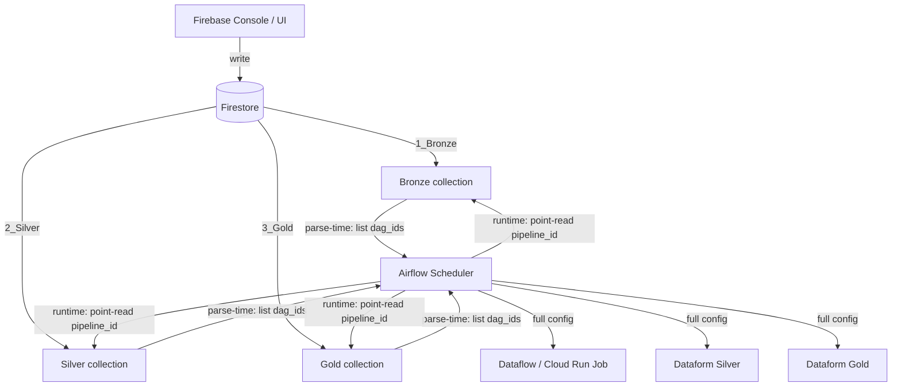

# BRAINSTORM: Firestore Pipeline Config Decoupling

> Exploratory session to clarify intent and approach before requirements capture

## Metadata

| Attribute | Value |
|-----------|-------|
| **Feature** | FIRESTORE_PIPELINE_CONFIG_DECOUPLING |
| **Date** | 2026-06-03 |
| **Author** | brainstorm-agent |
| **Status** | ✅ Complete (Defined) |

---

## Initial Idea

**Raw Input:** Desacoplar da esteira e do bucket do Composer os YAMLs de configuração de pipelines, criar uma config única e já evoluída (com o schema do Dataflow), e usar um banco desacoplado (equivalente ao DynamoDB) para que o Airflow envie o YAML completo ao Dataflow e as configs possam ser inseridas/alteradas sem redeploy.

**Context Gathered:**
- Stack atual: Apache Airflow (GCP Composer 2), Cloud Run Job (Bronze), Dataform (Silver/Gold), Dataflow (Bronze ingestion via Cloud Run)
- YAMLs hoje em `dags/config/{bronze,silver,gold}/*_pipeline.yaml` — acoplados ao bucket do Composer
- `medallion_factory/config_loader.py` lê arquivos do disco via mount GCS (`scan_layer_config_paths`)
- Dataflow tem YAML separado no bucket — mudanças exigem atualização em dois lugares
- Dataflow ainda não integrado ao Composer neste repo — sistema paralelo

**Technical Context Observed (for Define):**

| Aspect | Observation | Implication |
|--------|-------------|-------------|
| Likely Location | `dags/medallion_factory/` | config_loader.py e factories precisam ser substituídos |
| Relevant KB Domains | airflow-specialist, gcp-data-architect | DAG factory pattern + Firestore modeling |
| IaC Patterns | GCP IAM via Terraform (existente) | SA do Composer precisa de role Firestore |

---

## Discovery Questions & Answers

| # | Question | Answer | Impact |
|---|----------|--------|--------|
| Q1 | Qual camada o desacoplamento afeta? | (D) Todas — Bronze, Silver, Gold **e** Dataflow como clientes independentes | Config store unificado para todos os layers |
| Q2 | Qual é a dor do Dataflow hoje? | (A+C) YAML separado no bucket + ainda não integrado ao Composer | Dois YAMLs para manter; integração nova necessária |
| Q3 | Padrão de acesso das DAGs? | (C) Bulk scan de pipeline_ids no parse-time + point-read do doc completo no runtime | List leve no parse, GET completo por task |
| Q4 | Quem escreve as configs? | (C) Firebase Console / UI interna | Zero redeploy para mudar config de pipeline |
| Q5 | Estrutura do documento? | 3 coleções (`1_Bronze`, `2_Silver`, `3_Gold`), Document ID = pipeline_id | Espelha estrutura atual de diretórios YAML |
| Q6 | Design do DAG factory? | (D+A) Campo `dag_id` + `globals()` trick para auto-criar N DAGs | Parse-time leve; N DAGs dinâmicas |
| Q7 | Schema Silver e Gold? | (A) Ambos Dataform — campos existentes + `dag_id` + `schedules[]` | Schema conservador, migração simples |
| Q8a | Nome do campo de agrupamento? | (B) `dag_id` — vira literalmente o dag_id no Airflow | Zero mapeamento extra no factory |
| Q8b | Onde vive o cron? | Contrato B — `schedules[]` no doc, mesmo `dag_id` = mesmo cron | ConfigValidationError se violado no parse-time |
| Q8c | Onde deve ficar o campo `env`? | (B) O campo `env` deve ficar no documento Firestore | Mantém o contexto de execução junto da config canônica do pipeline |

---

## Sample Data Inventory

| Type | Location | Count | Notes |
|------|----------|-------|-------|
| Bronze YAML legado (repo) | `dags/config/bronze/grupo_pipeline.yaml` | 1 | Exemplo simples com `bronze.environment`, `dataset_name`, `table_name`, `processing_mode: full` |
| Bronze YAML legado (repo) | `dags/config/bronze/rel_demonstrativo_titular_pipeline.yaml` | 1 | Exemplo simples com `schedule_frequency: monthly` e `processing_mode: incremental_event` |
| Bronze schema evoluído (fonte do contrato final) | exemplos completos fornecidos pelo usuário nesta conversa | 3 | Fonte para campos nested como `queries`, `tables`, `compute`, `rows_limit`, `is_golden_gate`, `schedules[].type` |
| Silver YAML | `dags/config/silver/*_pipeline.yaml` | N | Objeto nested `silver`, `included_targets`; `assert_targets` aparece no template atual; `depends_on` top-level aparece em arquivos atuais |
| Gold YAML | `dags/config/gold/*_pipeline.yaml` | N | Objeto nested `gold`, `included_targets`, `depends_on`; `included_tags` **source not found** nos YAMLs locais atuais |

**How samples will be used:**
- Schema base para os documentos Firestore das 3 coleções
- Fixtures de teste para o migration script
- Validação do config_loader refatorado

---

## Approaches Explored

### Approach A: Firestore Native Mode ⭐ Recommended

**Description:** Firestore Native como config store — 3 coleções (`1_Bronze`, `2_Silver`, `3_Gold`), documento por pipeline_id, campo `dag_id` para agrupamento, `schedules[]` por contrato.

**Pros:**
- Modelo de dados perfeito: coleção por camada, documento por pipeline_id — espelha estrutura atual
- `list_documents()` retorna só refs (sem payload) — parse-time leve
- Point read `doc.get()` ~15ms — não bloqueia scheduler
- Serverless — zero instâncias para gerenciar
- Free tier cobre ~5k docs (50k reads/dia, 20k writes/dia)
- REST API nativa — qualquer cliente lê com HTTP + OIDC

**Cons:**
- Firebase Console tem UI genérica — sem validação de schema nativa
- Migração dos YAMLs existentes requer script de importação

**Why Recommended:** Volume de 5k docs está 3 ordens de grandeza abaixo do break-even de alternativas (Bigtable, Spanner). Free tier cobre o caso de uso inteiro. Modelo de documento se alinha 1:1 com a estrutura YAML existente.

---

### Approach B: Bigtable

**Description:** HBase-compatible wide-column store, row-key por pipeline_id, column families por camada.

**Pros:**
- Latência sub-milissegundo
- Escala para petabytes

**Cons:**
- Custo mínimo ~$0.65/h mesmo ocioso — ~$470/mês para 5k docs
- Requer design de row-key cuidadoso
- Sem suporte a documentos aninhados nativamente

---

### Approach C: Memorystore (Redis)

**Description:** Cache Redis gerenciado, chaves por pipeline_id, serialização JSON.

**Pros:**
- Latência ~1ms

**Cons:**
- Dados efêmeros — perda em restart
- Custo fixo ~$40/mês por instância mínima
- Sem query nativa (só GET por chave exata)
- Overhead operacional de cache invalidation

---

## Data Engineering Context

### Source Systems

| Source | Type | Volume Estimate | Current Freshness |
|--------|------|-----------------|-------------------|
| Bucket Composer (`dags/config/`) | GCS YAML files | ~5k docs max, 3 camadas | On push/deploy |
| Dataflow YAML (bucket separado) | GCS YAML files | N pipelines Bronze | Manual |

### Data Flow Sketch

```text
[Firebase Console / UI]
        │  write (ops team)
        ▼
[Firestore: 1_Bronze / 2_Silver / 3_Gold]
        │
        ├── parse-time: list_documents() → pipeline_ids → build DAG graph
        │
        └── runtime: doc(pipeline_id).get() → config completo
                          │
                          ├── Bronze → Dataflow (via Cloud Run Job)
                          ├── Silver → Dataform workflow invocation
                          └── Gold   → Dataform workflow invocation
```

### Possible Architecture Reference

- Supporting drawing accepted as a possible architecture reference: `docs/01-draw-archtecture.png`
- Use this drawing as visual support for the Firestore-centered configuration flow during Define/Design.



### Key Data Questions Explored

| # | Question | Answer | Impact |
|---|----------|--------|--------|
| 1 | Qual o volume esperado? | ~5k docs max, 3 coleções | Free tier do Firestore cobre; Bigtable/Spanner fora de questão |
| 2 | Qual o SLA de latência de leitura? | < 100ms (não travar UI do Airflow) | Firestore ~15ms atende; GCS parse atual ~200-500ms |
| 3 | Quem consome a config? | Airflow (parse + runtime), Dataflow workers, Dataform | REST API nativa do Firestore serve todos os clientes |

---

## Selected Approach

| Attribute | Value |
|-----------|-------|
| **Chosen** | Approach A — Firestore Native Mode |
| **User Confirmation** | 2026-06-03 |
| **Reasoning** | Free tier cobre o volume, modelo de documento espelha YAMLs existentes, serverless, REST API serve todos os clientes sem SDK obrigatório |

---

## Key Decisions Made

| # | Decision | Rationale | Alternative Rejected |
|---|----------|-----------|----------------------|
| 1 | Firestore Native Mode como config store | Free tier, ~15ms reads, serverless, modelo de documento | Bigtable (overkill), Redis (efêmero), Spanner (overkill) |
| 2 | 3 coleções: `1_Bronze`, `2_Silver`, `3_Gold` | Espelha estrutura de diretórios atual, separação por camada clara | Coleção única com campo `layer` |
| 3 | Document ID = `pipeline_id` | Sem campo interno duplicado, lookup direto por ID | Campo separado `pipeline_id` dentro do doc |
| 4 | Campo `dag_id` obrigatório em todos os docs | Vira literalmente o `dag_id` no Airflow sem mapeamento extra | Campo `group`, `pipeline_group` |
| 5 | Contrato: mesmo `dag_id` → mesmo cron | 1 DAG = 1 schedule no Airflow; validação no parse-time | Factory compor dag_id com sufixo de cron (Opção A) |
| 6 | Parse-time busca só `dag_id` + `schedules` | Não carrega payload completo no scheduler — UI leve | Carregar config completa no parse |
| 7 | Runtime faz point-read por pipeline_id | Config sempre fresca; não requer restart da DAG para pegar mudanças | Cache em variáveis Airflow |
| 8 | Escrita via Firebase Console | Zero redeploy para mudar config; desacoplamento total | CI/CD git-based, CLI script |
| 9 | Campo `env` fica no documento Firestore | O ambiente faz parte da configuração operacional consumida pelos clientes | Resolver `env` fora do documento |

---

## Final Firestore Schema Agreed

**Schema authority for this iteration:** (1) Bronze examples completos fornecidos pelo usuário nesta conversa; (2) YAMLs atuais do repo em `dags/config/silver/*.yaml`, `dags/config/gold/*.yaml` e `dags/config/schedules.yaml`; (3) regra já acordada de Firestore; (4) contraste com os YAMLs Bronze legados em `dags/config/bronze/*.yaml` para mapear o formato antigo ao contrato novo.

### Global rules for all collections

- Collection split remains explicit: `1_Bronze`, `2_Silver`, `3_Gold`
- **Document ID = `pipeline_id`**
- **Do not duplicate `pipeline_id` inside the document body**
- **`dag_id` is required** in every document
- **`env` is required** in every document
- **`schedules[]` is required** in every document
- Within `schedules[]`, `cron` is part of the canonical Firestore contract
- Contract: **1 `dag_id` = 1 cron**
- Parse-time DAG discovery reads document id + `dag_id` + `schedules[]` (+ `env` when needed for validation/context)
- Runtime fetch reads the full document by document id (`pipeline_id`)
- Current YAMLs use `schedule_frequency` + `dags/config/schedules.yaml`; Firestore must store the resolved schedule in `schedules[]`

### `1_Bronze`

**Intent:** document the final evolved Bronze schema using the complete Bronze examples supplied by the user, while keeping the agreed Firestore envelope.

```yaml
# Firestore collection: 1_Bronze
# Document ID: <pipeline_id>
dag_id: bronze_medallion
env: dev
schedules:
  - cron: "0 6 26 * *"
    type: incremental_event
comment: "Carga mensal consolidada"
rows_limit: null
is_golden_gate: true
queries:
  select_to_bq:
    select: "SELECT * FROM origem"
    where: "data_referencia >= @last_ref"
tables:
  origin:
    dataset: relatorio
    name: rel_demonstrativo_titular
    bound_column: data_referencia
    num_partition: 32
    incremental_fields:
      - data_referencia
    pk:
      - id_pagamento
    description: "Tabela origem do bronze"
    labels:
      responsable: ecad
      team: data-platform
  destiny:
    dataset: bronze_relatorio
    name: rel_demonstrativo_titular
    partition_field_name: data_referencia
    partition_field_type: timestamp
    partition_field_origin: data_referencia
    partition_field_origin_type: timestamp
    clustering_fields:
      - id_pagamento
compute:
  num_workers: 2
  max_workers: 8
  machine_type: n2-standard-4
```

**Bronze schema notes:**
- `queries` is **optional**
- `compute` is **optional**
- `is_golden_gate` is **optional when present**
- The execution type observed in the user-provided Bronze examples lives in **`schedules[].type`**
- **Do not assert a top-level `type` field without source**
- Required nested field coverage for the final contract:
  - `comment`
  - `rows_limit`
  - `is_golden_gate` (optional)
  - `queries.select_to_bq.select`
  - `queries.select_to_bq.where`
  - `tables.origin.dataset`
  - `tables.origin.name`
  - `tables.origin.bound_column`
  - `tables.origin.num_partition`
  - `tables.origin.incremental_fields` (`array` or `null`)
  - `tables.origin.pk`
  - `tables.origin.description`
  - `tables.origin.labels.responsable`
  - `tables.origin.labels.team`
  - `tables.destiny.dataset`
  - `tables.destiny.name`
  - `tables.destiny.partition_field_name`
  - `tables.destiny.partition_field_type`
  - `tables.destiny.partition_field_origin`
  - `tables.destiny.partition_field_origin_type`
  - `tables.destiny.clustering_fields`
  - `compute.num_workers`
  - `compute.max_workers`
  - `compute.machine_type`
  - `schedules[].cron`
  - `schedules[].type`
- Current repo Bronze YAMLs are legacy/simple inputs (`bronze.environment`, `dataset_name`, `table_name`, `processing_mode`) and are not the source of the final nested Bronze contract.

**Bronze YAML examples to preserve in documentation:**

```yaml
# Bronze tipo query / incremental_event
dag_id: bronze_medallion
env: dev
schedules:
  - cron: "0 6 26 * *"
    type: incremental_event
queries:
  select_to_bq:
    select: "SELECT id_pagamento, data_referencia FROM origem"
    where: "data_referencia >= @last_ref"
tables:
  origin:
    dataset: relatorio
    name: rel_demonstrativo_titular
    bound_column: data_referencia
    num_partition: 32
    incremental_fields:
      - data_referencia
    pk:
      - id_pagamento
    description: "Origem incremental"
    labels:
      responsable: ecad
      team: data-platform
  destiny:
    dataset: bronze_relatorio
    name: rel_demonstrativo_titular
    partition_field_name: data_referencia
    partition_field_type: timestamp
    partition_field_origin: data_referencia
    partition_field_origin_type: timestamp
    clustering_fields:
      - id_pagamento
```

```yaml
# Bronze com is_golden_gate
dag_id: bronze_medallion
env: dev
schedules:
  - cron: "0 6 * * *"
    type: full
is_golden_gate: true
tables:
  origin:
    dataset: arrecadacao
    name: grupo
    bound_column: null
    num_partition: null
    incremental_fields: null
    pk:
      - grupo_id
    description: "Carga full"
    labels:
      responsable: ecad
      team: data-platform
  destiny:
    dataset: bronze_arrecadacao
    name: grupo
    partition_field_name: null
    partition_field_type: null
    partition_field_origin: null
    partition_field_origin_type: null
    clustering_fields: []
```

```yaml
# Bronze full
dag_id: bronze_medallion
env: dev
schedules:
  - cron: "0 6 * * *"
    type: full
comment: "Carga bronze completa"
rows_limit: null
tables:
  origin:
    dataset: arrecadacao
    name: rubrica_grupo
    bound_column: null
    num_partition: null
    incremental_fields: null
    pk:
      - rubrica_id
    description: "Tabela full"
    labels:
      responsable: ecad
      team: data-platform
  destiny:
    dataset: bronze_arrecadacao
    name: rubrica_grupo
    partition_field_name: null
    partition_field_type: null
    partition_field_origin: null
    partition_field_origin_type: null
    clustering_fields: []
compute:
  num_workers: 1
  max_workers: 4
  machine_type: n2-standard-2
```

### `2_Silver`

**Intent:** reflect the current repo YAML contract with nested `silver`, top-level `depends_on`, and the Firestore envelope.

```yaml
# Firestore collection: 2_Silver
# Document ID: <pipeline_id>
dag_id: silver_medallion
env: dev
schedules:
  - cron: "0 6 26 * *"
silver:
  included_targets:
    - _control_freeze
    - rel_pagamentos_unificado
  assert_targets: []
depends_on:
  - fonograma_titular
  - obra_titular
```

**Silver schema notes:**
- Based on current YAMLs in `dags/config/silver/*.yaml`
- Firestore keeps the envelope `dag_id` + `env` + `schedules[]`
- Current YAMLs still use `schedule_frequency`; this must be translated to Firestore `schedules[]` using `dags/config/schedules.yaml`
- Nested `silver.assert_targets` is allowed when present; default/empty is allowed
- `depends_on` remains **top-level**

**Silver YAML example to preserve in documentation:**

```yaml
dag_id: silver_medallion
env: dev
schedules:
  - cron: "0 6 * * *"
silver:
  included_targets:
    - assert_cadastros
    - assert_pagamentos_unificado
  assert_targets: []
depends_on:
  - fonograma_titular
  - obra_titular
  - rel_demonstrativo_titular
```

### `3_Gold`

**Intent:** reflect the current repo YAML contract with nested `gold`, top-level `depends_on`, and the Firestore envelope.

```yaml
# Firestore collection: 3_Gold
# Document ID: <pipeline_id>
dag_id: gold_medallion
env: dev
schedules:
  - cron: "0 6 26 * *"
gold:
  included_targets:
    - ft_demonstrativo_titular
depends_on: []
```

**Gold schema notes:**
- Based on current YAMLs in `dags/config/gold/*.yaml`
- Firestore keeps the envelope `dag_id` + `env` + `schedules[]`
- `depends_on` remains **top-level**
- `included_tags` was **not found** in current local YAMLs; if mentioned later, treat it as **source not found / future extension**, not as a confirmed repo contract

**Gold YAML example to preserve in documentation:**

```yaml
dag_id: gold_medallion
env: dev
schedules:
  - cron: "0 6 26 * *"
gold:
  included_targets:
    - ft_demonstrativo_titular
depends_on:
  - assert_pii_gold
```

---

## Features Removed (YAGNI)

| Feature Suggested | Reason Removed | Can Add Later? |
|-------------------|----------------|----------------|
| Versionamento de documentos no Firestore | Complexidade desnecessária para MVP; Firebase Console tem histórico básico | Yes |
| UI interna customizada com validação de schema | Firebase Console cobre o caso de uso; UI custom é projeto separado | Yes |
| Sub-coleções por pipeline (`/pipelines/id/layers/bronze`) | Manifesto + sub-docs adiciona latência extra sem benefício claro para 5k docs | Yes |
| Coleção `dag_schedules` separada | Opção D descartada; `schedules[]` no doc com contrato é mais simples | Yes |
| Pipeline em múltiplas DAGs via schedules[] | Risco de race condition e duplicação; Opção C descartada | Yes |

---

## Incremental Validations

| Section | Presented | User Feedback | Adjusted? |
|---------|-----------|---------------|-----------|
| Store selection (Firestore vs alternativas) | ✅ | Confirmou Firestore | Não |
| Estrutura das 3 coleções + Document ID | ✅ | Confirmou + adicionou campo group/dag_id | Sim — campo `dag_id` adicionado |
| Schema `1_Bronze` unificado (2 YAMLs merge) | ✅ | Confirmou schema | Não |
| Schema `2_Silver` e `3_Gold` | ✅ | Confirmou (A) — Dataform puro | Não |
| DAG factory + globals() pattern | ✅ | Confirmou (D+A) com dag_id explícito | Sim — dag_id substituiu group |
| Resolução da tensão dag_id × múltiplos schedules | ✅ | Confirmou Opção B (contrato 1:1) | Não |
| Local do campo `env` | ✅ | Confirmou Opção B — `env` no documento Firestore | Sim — decisão registrada no brainstorm |

---

## Suggested Requirements for /workflow:define

### Problem Statement (Draft)
Os YAMLs de configuração de pipelines estão acoplados ao bucket do GCS/Composer e ao repositório de código, exigindo redeploy para qualquer mudança de configuração e mantendo o Dataflow em ciclo separado sem integração com o Composer.

### Target Users (Draft)

| User | Pain Point |
|------|------------|
| Time de dados (ops) | Precisa de redeploy para alterar config de pipeline; Dataflow tem ciclo separado |
| Engenheiro de dados | Manter YAMLs em dois repositórios diferentes para o mesmo pipeline |

### Success Criteria (Draft)
- [ ] Configs de pipeline editáveis via Firebase Console sem redeploy do Composer
- [ ] Airflow lê configs do Firestore em < 100ms no parse-time (só dag_id + schedules)
- [ ] Airflow envia config completa ao Dataflow/Dataform no runtime via point-read
- [ ] DAG factory cria automaticamente 1 DAG por valor único de `dag_id`
- [ ] ConfigValidationError emitido no parse-time se mesmo `dag_id` tiver crons diferentes
- [ ] Campo `env` persiste no documento Firestore e segue junto com a configuração do pipeline
- [ ] Migração dos YAMLs existentes para Firestore sem perda de dados
- [ ] 3 coleções Firestore: `1_Bronze`, `2_Silver`, `3_Gold`
- [ ] Todo documento usa `pipeline_id` apenas como Document ID, sem duplicação no payload
- [ ] `dag_id`, `env` e `schedules[]` são obrigatórios em Bronze, Silver e Gold
- [ ] Bronze preserva o schema evoluído do Dataflow com `comment`, `rows_limit`, `is_golden_gate` (opcional), `queries.select_to_bq`, `tables.origin`, `tables.destiny`, `compute` e tipo de execução em `schedules[].type` (sem afirmar `type` top-level sem source)
- [ ] Silver preserva o schema Dataform atual em objeto nested `silver` + envelope Firestore `dag_id` + `env` + `schedules[]` + `silver.included_targets` + `silver.assert_targets` + `depends_on`
- [ ] Gold preserva o schema Dataform atual em objeto nested `gold` + envelope Firestore `dag_id` + `env` + `schedules[]` + `gold.included_targets` + `depends_on`; `included_tags` fica como source not found / extensão futura

### Constraints Identified
- Stack GCP (sem AWS DynamoDB)
- Airflow Composer 2 — compatibilidade com `globals()` para DAG factory
- IAM: SA do Composer com `roles/datastore.viewer` apenas
- Free tier Firestore deve cobrir o volume (~5k docs, ~50k reads/dia)

### Out of Scope (Confirmed)
- UI interna customizada com validação de schema (futuro)
- Versionamento de documentos no Firestore (futuro)
- Agendamento Gold (a definir em feature separada)
- Autenticação/autorização de acesso ao Firebase Console (IAM GCP cobre)

---

## Session Summary

| Metric | Value |
|--------|-------|
| Questions Asked | 10 (Q1–Q8c) |
| Approaches Explored | 3 (Firestore, Bigtable, Redis) |
| Features Removed (YAGNI) | 5 |
| Validations Completed | 7 |
| Duration | 2026-06-03 (sessão única com pausa) |

---

## Revision History

| Version | Date | Author | Changes |
|---------|------|--------|---------|
| 1.0 | 2026-06-03 | brainstorm-agent | Initial brainstorm version |
| 1.1 | 2026-06-03 | iterate-agent | Added possible architecture reference `docs/01-draw-archtecture.png` and recorded decision that `env` stays in the Firestore document |
| 1.2 | 2026-06-04 | iterate-agent | Restored and detailed the final agreed Firestore schema for `1_Bronze`, `2_Silver`, and `3_Gold`, including the rules Document ID = `pipeline_id`, no duplicated `pipeline_id` field, required `dag_id`/`env`/`schedules[]`, and the `1 dag_id = 1 cron` contract |
| 1.3 | 2026-06-04 | iterate-agent | Refined the final Firestore contract with full nested Bronze field coverage, corrected Silver/Gold to nested `silver`/`gold` objects plus top-level `depends_on`, translated legacy `schedule_frequency` to `schedules[]`, and marked Gold `included_tags` as source not found / future extension |

---

## Next Step

**Ready for:** `/workflow:define ~/.config/opencode/sdd/features/firestore-pipeline-config-decoupling/BRAINSTORM_FIRESTORE_PIPELINE_CONFIG_DECOUPLING.md`
