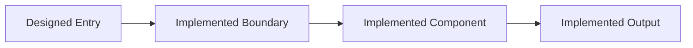

# BUILD REPORT: {Feature Name}

> Implementation report for {Feature Name}

## Metadata

| Attribute | Value |
|-----------|-------|
| **Feature** | {FEATURE_NAME} |
| **Date** | {YYYY-MM-DD} |
| **Author** | build-agent |
| **DEFINE** | [DEFINE_{FEATURE}.md](../features/DEFINE_{FEATURE}.md) |
| **DESIGN** | [DESIGN_{FEATURE}.md](../features/DESIGN_{FEATURE}.md) |
| **Status** | In Progress / Complete / Blocked / Ready for Validate |

---

## Summary

| Metric | Value |
|--------|-------|
| **Tasks Completed** | {X}/{Y} |
| **Files Created** | {N} |
| **Lines of Code** | {N} |
| **Build Time** | {Duration} |
| **Tests Passing** | {X}/{Y} |
| **Agents Used** | {N} |

## Implemented Architecture Snapshot

### Architecture As Built

```text
{Describe the actual implemented boundary, flow, and ownership after build.}
```

### Architecture Delta Diagram



---

## Task Execution with Agent Attribution

| # | Task | Agent | Status | Duration | Notes |
|---|------|-------|--------|----------|-------|
| 1 | {Task description} | @{agent-name} | ✅ Complete | {Xm} | {Any notes} |
| 2 | {Task description} | @{agent-name} | ✅ Complete | {Xm} | {Any notes} |
| 3 | {Task description} | (direct) | 🔄 In Progress | - | {No specialist matched} |
| 4 | {Task description} | @{agent-name} | ⏳ Pending | - | - |

**Legend:** ✅ Complete | 🔄 In Progress | ⏳ Pending | ❌ Blocked

**Agent Key:**
- `@{agent-name}` = Delegated to specialist agent via Task tool
- `(direct)` = Built directly by build-agent (no specialist matched)

---

## Agent Contributions

| Agent | Files | Specialization Applied |
|-------|-------|------------------------|
| @{agent-1} | {N} | {What patterns/KB used} |
| @{agent-2} | {N} | {What patterns/KB used} |
| (direct) | {N} | DESIGN patterns only |

---

## Files Created

| File | Lines | Agent | Verified | Notes |
| ---- | ----- | ----- | -------- | ----- |
| `{path/to/file1.py}` | {N} | @{agent-name} | ✅ | {Any notes} |
| `{path/to/file2.py}` | {N} | @{agent-name} | ✅ | {Any notes} |
| `{path/to/config.yaml}` | {N} | (direct) | ✅ | {Any notes} |

## Design-to-Build Delta

| Area | Designed | Built | Why it differs |
| --- | --- | --- | --- |
| {Area 1} | {Design intent} | {Implementation reality} | {Reason} |

---

## Verification Results

### Lint Check

```text
{Output from linter (e.g., ruff, eslint, rubocop) or "All checks passed"}
```

**Status:** ✅ Pass / ❌ Fail

### Type Check

```text
{Output from type checker (e.g., mypy, tsc) or "All checks passed" or "N/A - not configured"}
```

**Status:** ✅ Pass / ❌ Fail / ⏭️ Skipped

### Tests

```text
{Output from test runner (e.g., pytest, jest, go test) or summary}
```

| Test | Result |
|------|--------|
| `test_function_1` | ✅ Pass |
| `test_function_2` | ✅ Pass |
| `test_integration` | ✅ Pass |

**Status:** ✅ {X}/{Y} Pass | ❌ {N} Fail

## Loop Trace

| Iteration | Target | Gate | Result | Action Taken |
| --- | --- | --- | --- | --- |
| 1 | {File or chunk} | {Gate} | {Pass/Fail} | {Action} |

---

## Issues Encountered

| # | Issue | Resolution | Time Impact |
|---|-------|------------|-------------|
| 1 | {Description of issue} | {How it was resolved} | {+Xm} |
| 2 | {Description of issue} | {How it was resolved} | {+Xm} |

---

## Deviations from Design

| Deviation | Reason | Impact |
|-----------|--------|--------|
| {What changed from DESIGN} | {Why it changed} | {Effect on system} |

---

## Blockers (if any)

| Blocker | Required Action | Owner |
|---------|-----------------|-------|
| {Description} | {What needs to happen} | {Who can unblock} |

---

## Acceptance Test Verification

| ID | Scenario | Status | Evidence |
|----|----------|--------|----------|
| AT-001 | {From DEFINE} | ✅ Pass / ❌ Fail | {How verified} |
| AT-002 | {From DEFINE} | ✅ Pass / ❌ Fail | {How verified} |
| AT-003 | {From DEFINE} | ✅ Pass / ❌ Fail | {How verified} |

---

## Performance Notes

| Metric | Expected | Actual | Status |
|--------|----------|--------|--------|
| {Metric 1} | {From DEFINE} | {Measured} | ✅ / ❌ |
| {Metric 2} | {From DEFINE} | {Measured} | ✅ / ❌ |

---

## Data Quality Results (if applicable)

> Include this section when the build involves data pipelines, dbt models, or data infrastructure.

### dbt Build Results

```text
{Output from `dbt build --select {models}` or "N/A"}
```

**Status:** ✅ Pass / ❌ Fail

### SQL Lint Results

```text
{Output from `sqlfluff lint` or "N/A"}
```

**Status:** ✅ Pass ({N} files clean) / ❌ {N} violations

### Data Quality Checks

| Check | Tool | Result | Details |
|-------|------|--------|---------|
| {Null PK check} | {dbt test / GE} | ✅ / ❌ | {0 nulls found} |
| {Unique PK check} | {dbt test / GE} | ✅ / ❌ | {0 duplicates} |
| {Referential integrity} | {dbt test / GE} | ✅ / ❌ | {0 orphans} |
| {Row count sanity} | {dbt test / GE} | ✅ / ❌ | {N rows, within range} |
| {Freshness} | {dbt source freshness} | ✅ / ❌ | {Last update: HH:MM} |

### Pipeline Metrics

| Metric | Value |
|--------|-------|
| Models built | {N} |
| Tests passed | {X}/{Y} |
| SQL lint violations | {N} |
| Avg model build time | {X}s |
| Data freshness | {Within SLA / Exceeded} |

---

## Final Status

### Overall: {✅ COMPLETE / 🔄 IN PROGRESS / ❌ BLOCKED}

**Completion Checklist:**

- [ ] All tasks from manifest completed
- [ ] All verification checks pass
- [ ] All tests pass
- [ ] No blocking issues
- [ ] Acceptance tests verified
- [ ] Ready for /workflow:validate

## Build Notes For Future KT

- hardest boundary:
- most surprising implementation constraint:
- what a future maintainer should read first:

---

## Next Step

**If Complete:** `/workflow:validate ~/.config/opencode/sdd/features/{feature-name}/BUILD_REPORT_{FEATURE_NAME}.md`

**If Blocked:** Resolve blockers, then `/workflow:build` to resume

**If Issues Found:** `/workflow:iterate DESIGN_{FEATURE}.md "{change needed}"`
