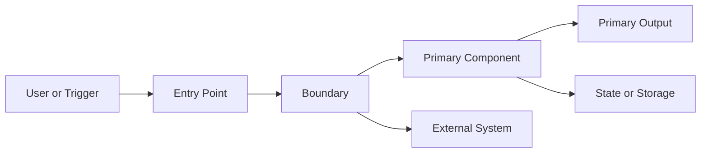
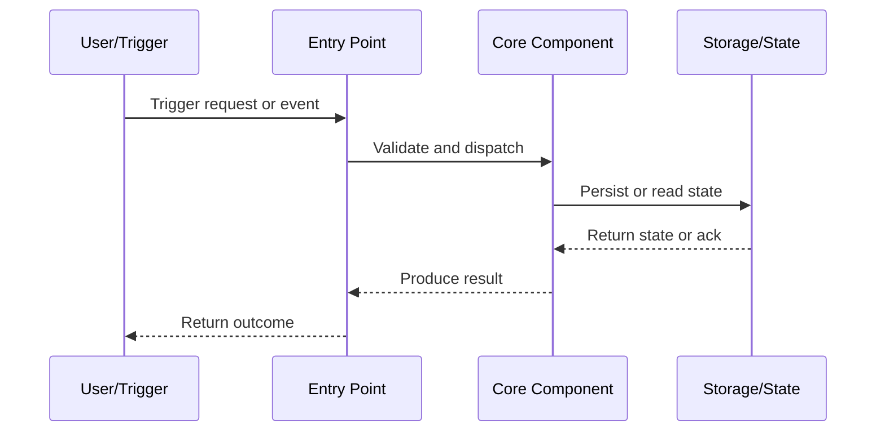
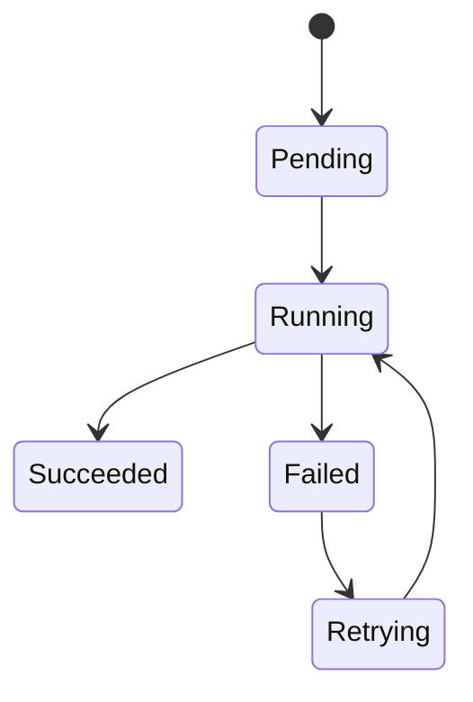

# DESIGN: {Feature Name}

> Technical design for implementing {Feature Name}

## Metadata

| Attribute | Value |
|-----------|-------|
| **Feature** | {FEATURE_NAME} |
| **Date** | {YYYY-MM-DD} |
| **Author** | design-agent |
| **DEFINE** | [DEFINE_{FEATURE}.md](./DEFINE_{FEATURE}.md) |
| **Status** | Draft / Ready for Build |

---

## Architecture Overview

```text
┌─────────────────────────────────────────────────────┐
│                   SYSTEM DIAGRAM                     │
├─────────────────────────────────────────────────────┤
│                                                      │
│  {ASCII diagram showing components and data flow}   │
│                                                      │
│  [Input] → [Component A] → [Component B] → [Output] │
│                ↓                 ↓                   │
│           [Storage]         [External API]          │
│                                                      │
└─────────────────────────────────────────────────────┘
```

### Architecture Context Diagram



### Sequence Diagram



---

## Components

| Component | Purpose | Technology |
|-----------|---------|------------|
| {Component A} | {What it does} | {Tech stack} |
| {Component B} | {What it does} | {Tech stack} |
| {Component C} | {What it does} | {Tech stack} |

### Component Responsibilities

| Component | Inputs | Outputs | Failure mode | Owner |
| --- | --- | --- | --- | --- |
| {Component A} | {Inputs} | {Outputs} | {Failure mode} | {Owner} |

---

## Key Decisions

### Decision 1: {Decision Name}

| Attribute | Value |
|-----------|-------|
| **Status** | Accepted |
| **Date** | {YYYY-MM-DD} |

**Context:** {Why this decision was needed}

**Choice:** {What we decided to do}

**Rationale:** {Why this is the right choice}

**Alternatives Rejected:**
1. {Option A} - Rejected because {reason}
2. {Option B} - Rejected because {reason}

**Consequences:**
- {Trade-off we accept}
- {Benefit we gain}

---

### Decision 2: {Decision Name}

{Repeat structure above}

---

## File Manifest

| # | File | Action | Purpose | Agent | Dependencies |
|---|------|--------|---------|-------|--------------|
| 1 | `{path/to/file.py}` | Create | {Purpose} | @{agent-name} | None |
| 2 | `{path/to/config.yaml}` | Create | {Purpose} | @{agent-name} | None |
| 3 | `{path/to/handler.py}` | Create | {Purpose} | @{agent-name} | 1, 2 |
| 4 | `{path/to/test.py}` | Create | {Purpose} | @{agent-name} | 3 |

**Total Files:** {N}

### File Tree Sketch

```text
{project-root}/
├── {path}/
│   ├── {file_1}
│   └── {file_2}
└── {tests_or_config}
```

---

## Agent Assignment Rationale

> Agents discovered from `~/.config/opencode/agents/` - Build phase invokes matched specialists.

| Agent | Files Assigned | Why This Agent |
|-------|----------------|----------------|
| @{agent-1} | 1, 3 | {Specialization match: e.g., "API routing patterns"} |
| @{agent-2} | 2 | {Specialization match: e.g., "data validation models"} |
| @{agent-3} | 4 | {Specialization match: e.g., "test fixtures"} |
| (general) | {if any} | {No specialist found - Build handles directly} |

**Agent Discovery:**
- Scanned: `~/.config/opencode/agents/*.agent.md`
- Matched by: File type, purpose keywords, path patterns, KB domains

---

## Code Patterns

### Pattern 1: {Pattern Name}

```python
# {Brief description of when to use this pattern}

{Copy-paste ready code snippet}
```

### Pattern 2: {Pattern Name}

```python
{Copy-paste ready code snippet}
```

### Pattern 3: Configuration Structure

```yaml
# config.yaml structure
{YAML configuration template}
```

### Interface Contracts

| Interface | Producer | Consumer | Contract | Failure handling |
| --- | --- | --- | --- | --- |
| {Interface 1} | {Producer} | {Consumer} | {Shape or protocol} | {Handling} |

---

## Data Flow

```text
1. {Step 1: e.g., "User submits request via API"}
   │
   ▼
2. {Step 2: e.g., "Request validated and queued"}
   │
   ▼
3. {Step 3: e.g., "Background worker processes request"}
   │
   ▼
4. {Step 4: e.g., "Results stored in database"}
```

### State Transitions



---

## Integration Points

| External System | Integration Type | Authentication |
|-----------------|-----------------|----------------|
| {System A} | {REST API / SDK / Queue} | {Method} |
| {System B} | {REST API / SDK / Queue} | {Method} |

---

## Testing Strategy

| Test Type | Scope | Files | Tools | Coverage Goal |
|-----------|-------|-------|-------|---------------|
| Unit | Functions | `{test files}` | {test framework} | 80% |
| Integration | API calls | `{integration test files}` | {test framework + mocks} | Key paths |
| E2E | Full flow | Manual | - | Happy path |

---

## Error Handling

| Error Type | Handling Strategy | Retry? |
|------------|-------------------|--------|
| {Error A} | {How to handle} | Yes/No |
| {Error B} | {How to handle} | Yes/No |
| {Error C} | {How to handle} | Yes/No |

### Failure Mode Notes

| Failure mode | Detection signal | Recovery path | Escalation |
| --- | --- | --- | --- |
| {Failure mode 1} | {Signal} | {Recovery} | {Escalation} |

---

## Configuration

| Config Key | Type | Default | Description |
|------------|------|---------|-------------|
| `{key_1}` | string | `{default}` | {What it controls} |
| `{key_2}` | int | `{default}` | {What it controls} |
| `{key_3}` | bool | `{default}` | {What it controls} |

---

## Security Considerations

- {Security consideration 1}
- {Security consideration 2}
- {Security consideration 3}

---

## Observability

| Aspect | Implementation |
|--------|----------------|
| Logging | {Approach: e.g., "Structured JSON logging"} |
| Metrics | {Approach: e.g., "Custom metrics via monitoring service"} |
| Tracing | {Approach: e.g., "OpenTelemetry spans"} |

### Observability Topology

```text
{Entry or workload}
  -> logs: {location or format}
  -> metrics: {system or dashboard}
  -> traces: {tracing boundary}
  -> alerts: {ownership}
```

---

## Pipeline Architecture (if applicable)

> Include this section when the feature involves data pipelines, ETL, or analytics.

### DAG Diagram

```text
[Source A] ──extract──→ [Raw Layer] ──transform──→ [Staging] ──model──→ [Marts]
[Source B] ──extract──↗       ↓                       ↓              ↓
                          [Archive]            [Quality Gate]   [Dashboard]
```

### Partition Strategy

| Table | Partition Key | Granularity | Rationale |
|-------|-------------|-------------|-----------|
| {table_1} | {column} | {daily / monthly} | {Query patterns, volume} |

### Incremental Strategy

| Model | Strategy | Key Column | Lookback |
|-------|----------|------------|----------|
| {model_1} | {incremental_by_time / unique_key / full_refresh} | {column} | {N days} |

### Schema Evolution Plan

| Change Type | Handling | Rollback |
|-------------|----------|----------|
| New column | {Add with DEFAULT, backfill async} | {Drop column} |
| Type change | {Dual-write period, then migrate} | {Revert type} |
| Column removal | {Deprecate in contract, remove after N days} | {Re-add column} |

### Data Quality Gates

| Gate | Tool | Threshold | Action on Failure |
|------|------|-----------|-------------------|
| {Null check on PKs} | {dbt test / GE} | {0 nulls} | {Block pipeline} |
| {Row count delta} | {dbt test / GE} | {<10% variance} | {Alert + continue} |
| {Freshness check} | {dbt source freshness} | {< N hours} | {Alert} |

---

## Validation Contract

> This section is read by `/workflow:validate` at Phase 3.5. Fill it now so the quality gate has explicit targets — not implicit guesses.

### Spec Junta Targets (alignment + architecture)

| Requirement ID | Description               | Expected Evidence in Code             |
|----------------|---------------------------|---------------------------------------|
| REQ-001        | {Requirement from DEFINE} | {File or function that implements it} |
| REQ-002        | {Requirement from DEFINE} | {File or function that implements it} |

**Architecture decisions to verify:**

| Decision                        | Expected Pattern in Code                                                 |
|---------------------------------|--------------------------------------------------------------------------|
| {Decision 1 from Key Decisions} | {What the validator should find: e.g., "class uses dataclass, not dict"} |
| {Decision 2 from Key Decisions} | {e.g., "config loaded from YAML, no hardcoded values"}                   |

---

### Code Junta Targets (quality + devops)

| Dimension      | Expectation                                                                      |
|----------------|----------------------------------------------------------------------------------|
| Type hints     | All functions have full type annotations                                         |
| Error handling | {e.g., "All external calls wrapped in try/except with specific exceptions"}      |
| Test coverage  | {e.g., "Unit tests for all transformations; integration test for full pipeline"} |
| DevOps         | {e.g., "requirements.txt pinned; no secrets in code; .env in .gitignore"}        |
| Security       | {e.g., "No hardcoded credentials; inputs validated at boundary"}                 |

---

### Delivery Junta Targets (manifest completeness)

All files in the File Manifest above are expected to exist in the code tree at build time.

| File                    | Delivery Status at Design Time |
|-------------------------|--------------------------------|
| `{path/to/file.py}`     | Planned                        |
| `{path/to/config.yaml}` | Planned                        |

**Acceptance criteria mapping** (from DEFINE → delivery evidence):

| Acceptance Test               | Delivered By                     |
|-------------------------------|----------------------------------|
| {Given/When/Then from DEFINE} | {Test file or validation script} |

---

### Score Targets

| Junta               | Minimum Score | Zero Tolerance       |
|---------------------|---------------|----------------------|
| Spec (alignment)    | ≥ 90          | CRITICAL findings    |
| Spec (architecture) | ≥ 90          | CRITICAL findings    |
| Code (quality)      | ≥ 90          | CRITICAL findings    |
| Code (devops)       | ≥ 70          | secrets in code      |
| Delivery (delta)    | ≥ 90          | MISSING requirements |
| **Overall**         | **≥ 90**      | **0 CRITICAL**       |

---

## Revision History

| Version | Date | Author | Changes |
|---------|------|--------|---------|
| 1.0 | {YYYY-MM-DD} | design-agent | Initial version |

---

## Next Step

**Ready for:** `/workflow:build ~/.config/opencode/sdd/features/{feature-name}/DESIGN_{FEATURE_NAME}.md`
