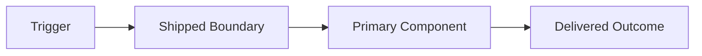

# SHIPPED: {Feature Name}

> Feature shipped on {YYYY-MM-DD}

## Metadata

| Attribute | Value |
|-----------|-------|
| **Feature** | {FEATURE_NAME} |
| **Ship Date** | {YYYY-MM-DD} |
| **Author** | ship-agent |

---

## Summary

{One paragraph describing what was built and the business value delivered.}

## Final Architecture Snapshot

### Final State As Text

```text
{Describe the final delivered architecture, workflow, or operating model.}
```

### Final Diagram



---

## Timeline

| Milestone | Date | Duration |
|-----------|------|----------|
| Define Started | {YYYY-MM-DD} | - |
| Define Complete | {YYYY-MM-DD} | {X days} |
| Design Complete | {YYYY-MM-DD} | {X days} |
| Build Complete | {YYYY-MM-DD} | {X days} |
| **Shipped** | {YYYY-MM-DD} | **Total: {X days}** |

---

## Metrics

| Metric | Value |
|--------|-------|
| **Total Files Created** | {N} |
| **Lines of Code** | {N} |
| **Tests Written** | {N} |
| **Test Coverage** | {X}% |
| **Build Iterations** | {N} |
| **Validation Score** | {SCORE}/100 |
| **Design Decisions** | {N} |

---

## What Was Built

### Components

| Component | Description |
|-----------|-------------|
| {Component 1} | {What it does} |
| {Component 2} | {What it does} |

### Files

| File | Purpose |
|------|---------|
| `{path/to/file1}` | {Purpose} |
| `{path/to/file2}` | {Purpose} |

## Boundary and Ownership Map

| Boundary | Owner | Notes for future maintainers |
| --- | --- | --- |
| {Boundary 1} | {Owner} | {Notes} |

---

## Success Criteria Verification

| Criterion | Target | Actual | Status |
|-----------|--------|--------|--------|
| {From DEFINE} | {Target} | {Actual} | ✅ / ❌ |
| {From DEFINE} | {Target} | {Actual} | ✅ / ❌ |
| {From DEFINE} | {Target} | {Actual} | ✅ / ❌ |

---

## Validation Gate

| Gate | Result |
|------|--------|
| Validation report | `VALIDATION_REPORT_{FEATURE}.md` |
| Runbook | `RUNBOOK_{FEATURE}.md` |
| Score | {SCORE}/100 |
| Critical issues | {CRITICAL_ISSUE_COUNT} |
| Ship approval | Approved only when score >= 90 and critical issues = 0 |

---

## Lessons Learned

### Process

{What would you do differently in the process next time?}

- {Lesson 1: Be specific and actionable}
- {Lesson 2: Include what worked AND what didn't}

### Technical

{What technical insights were gained?}

- {Lesson 1: Technical discovery or pattern that worked}
- {Lesson 2: Technical challenge and how it was solved}

### Architecture

- {Boundary that proved correct or incorrect}
- {Integration or state-model lesson}

### Communication

{Where did early clarification help or would have helped?}

- {Lesson 1: What clarification prevented rework}
- {Lesson 2: What confusion could have been avoided}

### Tools & Libraries

{What tools or libraries proved valuable?}

- {Tool/Library 1: Why it was helpful}
- {Tool/Library 2: Why it was helpful}

---

## Recommendations for Future Work

| Area | Recommendation |
|------|----------------|
| {Area 1} | {Specific recommendation} |
| {Area 2} | {Specific recommendation} |

## Operational Follow-Through

| Topic | Current state | Follow-up owner |
| --- | --- | --- |
| Monitoring | {State} | {Owner} |
| Docs and KT | {State} | {Owner} |

---

## Archived Artifacts

| Artifact | Location |
|----------|----------|
| BRAINSTORM | `./BRAINSTORM_{FEATURE}.md` (if Phase 0 was used) |
| DEFINE | `./DEFINE_{FEATURE}.md` |
| DESIGN | `./DESIGN_{FEATURE}.md` |
| BUILD_REPORT | `./BUILD_REPORT_{FEATURE}.md` |
| VALIDATION_REPORT | `./VALIDATION_REPORT_{FEATURE}.md` |
| RUNBOOK | `./RUNBOOK_{FEATURE}.md` |
| SHIPPED | `./SHIPPED_{DATE}.md` (this file) |

---

## Acknowledgments

{Optional: Note any particular challenges overcome or valuable contributions.}

---

*Feature archived on {YYYY-MM-DD} by ship-agent*
